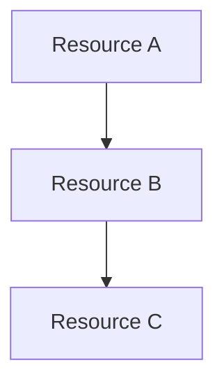

## 3. Networking

### 3.1 Network Topology

{VNet design, address spaces, subnet allocation}

### 3.2 Virtual Networks

| VNet Name   | Address Space | Region   | Purpose   |
| ----------- | ------------- | -------- | --------- |
| {vnet-name} | {CIDR}        | {region} | {purpose} |

### 3.3 Subnets

| Subnet      | Address Range | NSG        | Purpose   |
| ----------- | ------------- | ---------- | --------- |
| {snet-name} | {CIDR}        | {nsg-name} | {purpose} |

### 3.4 Network Security Groups

{Key NSG rules - details in appendix}

### 3.5 DNS Configuration

{DNS strategy - Azure DNS, Private DNS Zones}

### 3.6 Connectivity

{ExpressRoute, VPN, peering if applicable}

---

## 4. Storage

### 4.1 Storage Accounts

| Account   | SKU    | Replication   | Purpose   |
| --------- | ------ | ------------- | --------- |
| {st-name} | {tier} | {LRS/GRS/ZRS} | {purpose} |

### 4.2 Encryption

{Encryption at rest configuration}

### 4.3 Access Controls

{RBAC, SAS policies, private endpoints}

---

## 5. Compute

### 5.1 Compute Resources

| Resource    | Type            | SKU    | Purpose   |
| ----------- | --------------- | ------ | --------- |
| {app-name}  | App Service     | {sku}  | {purpose} |
| {func-name} | Function App    | {sku}  | {purpose} |
| {vm-name}   | Virtual Machine | {size} | {purpose} |

### 5.2 Scaling Configuration

{Auto-scale rules, instance counts}

### 5.3 Availability

{Availability zones, availability sets}

---

## 6. Identity & Access

### 6.1 Authentication

{Azure AD integration, authentication methods}

### 6.2 Authorization (RBAC)

| Principal  | Role   | Scope         |
| ---------- | ------ | ------------- |
| {identity} | {role} | {resource/rg} |

### 6.3 Managed Identities

{System-assigned, user-assigned identities}

### 6.4 Service Principals

{Application registrations if applicable}

---

## 7. Security & Compliance

### 7.1 Security Baseline

{Azure Security Benchmark alignment}

### 7.2 Network Security

{NSG summary, private endpoints, WAF}

### 7.3 Data Protection

{Encryption, key management}

### 7.4 Compliance Requirements

{Regulatory requirements - GDPR, PCI-DSS, etc.}

### 7.5 Azure Policy

{Governance policies applied - from 04-governance-constraints.md}

---

## 8. Backup & Disaster Recovery

### 8.1 Backup Strategy

| Resource   | Backup Method | Retention | RPO     |
| ---------- | ------------- | --------- | ------- |
| {resource} | {method}      | {days}    | {hours} |

### 8.2 Disaster Recovery

| Metric | Target  | Achieved |
| ------ | ------- | -------- |
| RTO    | {hours} | {status} |
| RPO    | {hours} | {status} |

### 8.3 Failover Procedures

{High-level failover process - details in 07-backup-dr-plan.md}

---

## 9. Management & Monitoring

### 9.1 Monitoring Strategy

{Log Analytics, Application Insights}

### 9.2 Alerting

| Alert        | Condition   | Severity | Action   |
| ------------ | ----------- | -------- | -------- |
| {alert-name} | {condition} | {sev}    | {action} |

### 9.3 Diagnostics

{Diagnostic settings configuration}

### 9.4 Maintenance

{Patching strategy, update management}

---

## 10. Appendix

### 10.1 Full Resource Inventory

See [07-resource-inventory.md](./07-resource-inventory.md)

### 10.2 IP Address Allocation

{Complete IP address table}

### 10.3 NSG Rules Detail

{Full NSG rule listings}

### 10.4 Cost Breakdown

See [07-ab-cost-estimate.md](./07-ab-cost-estimate.md) for as-built cost analysis.

For comparison with design estimates, see [03-des-cost-estimate.md](./03-des-cost-estimate.md).

### 10.5 Architecture Decision Records

{Links to relevant ADRs}

### 10.6 References

- [Azure Well-Architected Framework](https://learn.microsoft.com/azure/well-architected/)
- [Cloud Adoption Framework](https://learn.microsoft.com/azure/cloud-adoption-framework/)
- [Azure Architecture Center](https://learn.microsoft.com/azure/architecture/)
```

---

### 07-operations-runbook.md

```markdown
# Operations Runbook: {Project Name}

**Version**: 1.0
**Date**: {YYYY-MM-DD}
**Environment**: {Production|Staging|Development}

---

## Quick Reference

| Item            | Value         |
| --------------- | ------------- |
| Primary Region  | swedencentral |
| Resource Group  | {rg-name}     |
| Support Contact | {contact}     |
| Escalation Path | {path}        |

---

## 1. Daily Operations

### 1.1 Health Checks

{Daily monitoring tasks}

### 1.2 Log Review

{Log Analytics queries for daily review}

---

## 2. Routine Maintenance

### 2.1 Weekly Tasks

{Weekly maintenance activities}

### 2.2 Monthly Tasks

{Monthly maintenance activities}

### 2.3 Patching Schedule

{Update management configuration}

---

## 3. Incident Response

### 3.1 Severity Definitions

| Severity | Definition          | Response Time     |
| -------- | ------------------- | ----------------- |
| Sev 1    | Complete outage     | 15 minutes        |
| Sev 2    | Degraded service    | 1 hour            |
| Sev 3    | Minor issue         | 4 hours           |
| Sev 4    | Cosmetic/Low impact | Next business day |

### 3.2 Common Issues & Resolutions

{Troubleshooting guide for common issues}

---

## 4. Scaling Procedures

### 4.1 Scale Up

{Procedures to increase capacity}

### 4.2 Scale Down

{Procedures to reduce capacity}

---

## 5. Deployment Procedures

### 5.1 Standard Deployment

{Normal deployment process}

### 5.2 Emergency Deployment

{Hotfix deployment process}

### 5.3 Rollback Procedures

{How to rollback a failed deployment}

---

## 6. Contact Information

| Role              | Contact   | Escalation   |
| ----------------- | --------- | ------------ |
| Primary On-Call   | {contact} | {escalation} |
| Secondary On-Call | {contact} | {escalation} |
| Management        | {contact} | {escalation} |
```

---

### 07-resource-inventory.md

````markdown
# Resource Inventory: {Project Name}

**Generated**: {YYYY-MM-DD}
**Source**: Infrastructure as Code (Bicep)
**Environment**: {Production|Staging|Development}

---

## Summary

| Category        | Count |
| --------------- | ----- |
| Total Resources | {n}   |
| Compute         | {n}   |
| Storage         | {n}   |
| Networking      | {n}   |
| Security        | {n}   |
| Monitoring      | {n}   |

---

## Resource Listing

### Compute Resources

| Name   | Type   | SKU   | Location   | Resource Group |
| ------ | ------ | ----- | ---------- | -------------- |
| {name} | {type} | {sku} | {location} | {rg}           |

### Storage Resources

| Name   | Type   | SKU   | Replication   | Location   |
| ------ | ------ | ----- | ------------- | ---------- |
| {name} | {type} | {sku} | {replication} | {location} |

### Networking Resources

| Name   | Type   | Details   | Location   |
| ------ | ------ | --------- | ---------- |
| {name} | {type} | {details} | {location} |

### Security Resources

| Name   | Type   | Purpose   | Location   |
| ------ | ------ | --------- | ---------- |
| {name} | {type} | {purpose} | {location} |

### Monitoring Resources

| Name   | Type   | Scope   | Location   |
| ------ | ------ | ------- | ---------- |
| {name} | {type} | {scope} | {location} |

---

## IP Address Allocation

| Resource | Private IP   | Public IP   | Subnet   |
| -------- | ------------ | ----------- | -------- |
| {name}   | {private-ip} | {public-ip} | {subnet} |

---

## Dependencies


````

---

## Tags Applied

| Resource | Environment | Project   | Owner   | CostCenter |
| -------- | ----------- | --------- | ------- | ---------- |
| {name}   | {env}       | {project} | {owner} | {cc}       |

````

---

## Workflow

### Step 1: Gather Inputs

1. Check for existing artifacts in `agent-output/{project}/`
2. Read WAF assessment for architecture context
3. Read implementation plan for resource specifications
4. Read Bicep code for technical details
5. Read diagrams for visual reference

### Step 2: Generate Documentation Index

Create `07-documentation-index.md` listing all documents to be generated.

### Step 3: Generate Design Document

Create `07-design-document.md` following the 10-section structure:
- Extract content from existing artifacts
- Fill gaps with IaC analysis
- Add context from WAF assessment
- Reference diagrams and ADRs

### Step 4: Generate Operations Runbook

Create `07-operations-runbook.md` with:
- Day-2 operational procedures
- Incident response guidelines
- Scaling and deployment procedures

### Step 5: Generate Resource Inventory

Create `07-resource-inventory.md` by parsing:
- Bicep templates for resource definitions
- Parameter files for configuration values
- Generate dependency diagrams

### Step 6: Generate As-Built Cost Estimate (MANDATORY)

Create `07-ab-cost-estimate.md` using Azure Pricing MCP tools:

**Workflow:**

1. **Parse Bicep Templates** - Extract all resource types and SKUs from `infra/bicep/{project}/`
2. **Query Azure Pricing MCP** - Use `azure_price_search` for each resource/SKU combination
3. **Calculate Totals** - Use `azure_cost_estimate` for monthly/annual projections
4. **Compare to Design** - If `03-des-cost-estimate.md` exists, show variance analysis
5. **Generate File** - Create `07-ab-cost-estimate.md` with full breakdown

**As-Built Cost Estimate Template**

Use the canonical template and fill it out:

- Template: [../templates/07-ab-cost-estimate.template.md](../templates/07-ab-cost-estimate.template.md)
- Standard: `.github/instructions/cost-estimate.instructions.md`

Hard requirements:

- Keep the 10 core H2 headings exactly and in order.
- Include the colored Mermaid pie init exactly as in the template.
- Add IaC coverage + design-vs-as-built variance using H3s inside core headings.

Authoritative standard: `.github/instructions/cost-estimate.instructions.md`

### Step 7: Generate Optional Documents

If requested, create:

- `07-compliance-matrix.md` - Security control mappings
- `07-backup-dr-plan.md` - Detailed DR procedures

---

## Approval Gate

After generating documentation, present:

> **📚 Workload Documentation Generated**
>
> I've created the following documentation package for **{project-name}**:
>
> | Document                      | Status     |
> | ----------------------------- | ---------- |
> | Documentation Index           | ✅ Created |
> | Design Document (10 sections) | ✅ Created |
> | Operations Runbook            | ✅ Created |
> | Resource Inventory            | ✅ Created |
>
> **Output Location**: `agent-output/{project}/07-*.md`
>
> **Optional Documents Available**:
>
> - Compliance Matrix (reply "compliance" to generate)
> - Backup & DR Plan (reply "dr" to generate)
>
> **Do you approve this documentation package?**
>
> - Reply **"yes"** or **"approve"** to finalize
> - Reply **"compliance"** or **"dr"** to generate additional documents
> - Reply with **feedback** to revise

---

## Guardrails

**DO:**

- ✅ Synthesize from existing agent outputs (don't regenerate)
- ✅ Reference diagrams and ADRs (don't duplicate)
- ✅ Extract resource details from Bicep code
- ✅ Follow the 10-section design document structure
- ✅ Use consistent formatting and visual indicators
- ✅ Include actionable operational procedures

**DO NOT:**

- ❌ Query live Azure resources (IaC-only approach)
- ❌ Duplicate content already in WAF assessment or ADRs
- ❌ Generate documentation without reading existing artifacts first
- ❌ Create overly long documents (use appendix references)
- ❌ Skip the approval gate before finalizing

---

## Quality Checklist

Before finalizing documentation:

- [ ] All 10 sections of design document populated
- [ ] Resource inventory matches Bicep definitions
- [ ] Diagrams referenced correctly
- [ ] ADRs linked appropriately
- [ ] Cost estimate referenced
- [ ] Operations runbook has actionable procedures
- [ ] Tags and naming conventions documented
- [ ] Regional choices documented with rationale
- [ ] Dependencies clearly mapped
- [ ] Document index complete and accurate

```

```
