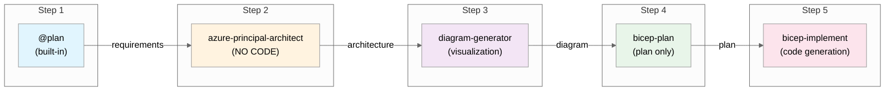

# GitHub Copilot Azure Infrastructure Workflow

[](https://github.com/features/copilot)
[](https://azure.microsoft.com)
[](https://learn.microsoft.com/azure/azure-resource-manager/bicep/)

[](LICENSE)
[](https://code.visualstudio.com/docs/devcontainers/containers)

---

> **Build Azure infrastructure with AI-powered agents.** A 5-step workflow that takes you from
> requirements to deployed Bicep templates—with architecture guidance, diagrams, validation,
> and best practices built in.

📖 **[Quick Start Guide](docs/QUICKSTART.md)** | 📋 **[Full Workflow Docs](docs/WORKFLOW.md)** | 🎯 **[Demo Prompts](demos/)**

<!-- TODO: Add animated demo GIF showing the workflow in action
     To create: Use https://github.com/charmbracelet/vhs or screen recording
     Target: ~30 second GIF showing @plan → architecture → diagram → bicep flow
-->

## The Workflow



| Step | Agent                       | What It Does                                                           |
| ---- | --------------------------- | ---------------------------------------------------------------------- |
| 1    | `@plan`                     | Gather requirements and create implementation plan with cost estimates |
| 2    | `azure-principal-architect` | Azure Well-Architected Framework assessment (NO code)                  |
| 3    | `diagram-generator`         | Generate Python architecture diagrams                                  |
| 4    | `bicep-plan`                | Create detailed implementation plan with AVM modules                   |
| 5    | `bicep-implement`           | Generate and validate Bicep templates                                  |

**Optional agent:** `adr-generator` (Architecture Decision Records)

---

## Quick Start

### 1. Open in Dev Container

```bash
git clone https://github.com/jonathan-vella/github-copilot-demo.git
code github-copilot-demo
# F1 → "Dev Containers: Reopen in Container"
```

### 2. Start the Workflow

1. Open GitHub Copilot Chat (`Ctrl+Alt+I`)
2. Click the **Agent** button or press `Ctrl+Shift+A`
3. Select `@plan` and describe your infrastructure

### 3. Example Conversation

```
You: @plan Create a HIPAA-compliant patient portal with Azure App Service and SQL Database

Plan Agent: [Generates requirements plan]
            Do you approve this plan?

You: yes

[Handoff to azure-principal-architect]

Architect: [Provides WAF assessment - Security, Reliability, Performance scores]
           Do you approve this architecture?

You: approve

[Handoff to diagram-generator]

Diagram: [Generates Python architecture diagram]
         ✅ Created docs/diagrams/patient-portal/architecture.py
         ✅ Generated architecture.png

You: continue

[Handoff to bicep-plan]

Planner: [Creates implementation plan]
         Do you approve this plan?

You: yes

[Handoff to bicep-implement]

Implementer: [Generates Bicep templates]
             ✅ bicep build passed
             ✅ bicep lint passed
             Ready to deploy?
```

---

## Workflow Details

Each step requires your approval before proceeding:

| Your Response     | What Happens             |
| ----------------- | ------------------------ |
| `yes` / `approve` | Continue to next step    |
| Feedback text     | Agent refines its output |
| `no`              | Return to previous step  |

📖 **[Full Workflow Documentation](docs/WORKFLOW.md)**

---

## Project Structure

```
github-copilot-demo/
├── .github/agents/              # Agent definitions
│   ├── azure-principal-architect.agent.md
│   ├── bicep-plan.agent.md
│   ├── bicep-implement.agent.md
│   ├── diagram-generator.agent.md
│   ├── adr-generator.agent.md
│   └── infrastructure-specialist.agent.md
├── .bicep-planning-files/       # Generated implementation plans
├── infra/bicep/                 # Generated Bicep templates
├── docs/
│   ├── WORKFLOW.md              # Workflow documentation
│   ├── adr/                     # Architecture Decision Records
│   └── diagrams/                # Generated architecture diagrams
├── demos/                       # Demo scenarios
│   └── demo-prompts.md          # Ready-to-use demo prompts
└── demo-output/                 # Sample agent outputs
```

---

## Requirements

- **VS Code** with GitHub Copilot extension
- **Azure subscription** (for deployments)
- **Dev Container** support (Docker Desktop or GitHub Codespaces)

The Dev Container includes: Azure CLI, Bicep CLI, PowerShell 7, and all required VS Code extensions.

---

## Contributing

Contributions welcome! See [CONTRIBUTING.md](CONTRIBUTING.md).

## License

MIT License — see [LICENSE](LICENSE).
