# Agentic InfraOps

> **Version 3.1.0** | Last Updated: December 3, 2025 | [Changelog](VERSION.md)

[](https://github.com/jonathan-vella/azure-agentic-infraops)
[](https://azure.microsoft.com)
[](https://github.com/features/copilot)
[](https://learn.microsoft.com/azure/well-architected/)

[](LICENSE)
[](https://code.visualstudio.com/docs/devcontainers/containers)

🔗 **Shortlink**: [aka.ms/agenticinfraops](https://aka.ms/agenticinfraops)

---

> **Azure infrastructure engineered by agents. Verified. Well-Architected. Deployable.**
>
> Agentic InfraOps revolutionizes how IT Pros build Azure environments. Powered by GitHub Copilot
> and coordinated AI agents, it transforms requirements into architecture diagrams, validated designs,
> and deploy-ready Bicep/Terraform templates—all aligned with Azure Well-Architected best practices
> and Azure Verified Modules. Real-time pricing, compliance checks, and automation included.

📖 **[Quick Start Guide](docs/getting-started/QUICKSTART.md)** | 📋 **[Full Workflow Docs](docs/workflow/WORKFLOW.md)** | 🎯 **[Scenarios](scenarios/)** | 💰 **[Azure Pricing MCP](mcp/azure-pricing-mcp/)**

## The Workflow

```mermaid
%%{init: {'theme':'neutral'}}%%
graph LR
    P["@plan"] --> A[azure-principal-architect]
    A --> B[bicep-plan]
    B --> I[bicep-implement]
    MCP["💰 Azure Pricing MCP"] -.->|costs| A
    MCP -.->|validation| B
    D[diagram-generator] -.->|visuals| A
```



| Step | Agent                       | What It Does                         | Optional                |
| ---- | --------------------------- | ------------------------------------ | ----------------------- |
| 1    | `@plan`                     | Gather requirements                  | -                       |
| 2    | `azure-principal-architect` | WAF assessment (NO code)             | 💰 Pricing, 📊 Diagrams |
| 3    | `bicep-plan`                | Implementation plan with AVM modules | 💰 Pricing              |
| 4    | `bicep-implement`           | Generate & validate Bicep            | -                       |

> **Optional:** `adr-generator` for Architecture Decision Records after any step

---

## Quick Start

### 1. Open in Dev Container

```bash
git clone https://github.com/jonathan-vella/azure-agentic-infraops.git
code azure-agentic-infraops
# F1 → "Dev Containers: Reopen in Container"
```

### 2. Start the Workflow

1. Open GitHub Copilot Chat (`Ctrl+Alt+I`)
2. Click the **Agent** button or press `Ctrl+Shift+A`
3. Select `@plan` and describe your infrastructure

### 3. Try It

```
@plan Create a HIPAA-compliant patient portal with Azure App Service and SQL Database
```

Each agent asks for approval before proceeding. Say `yes` to continue, or provide feedback to refine.

---

## Project Structure

| Directory                | Purpose                               |
| ------------------------ | ------------------------------------- |
| `.github/agents/`        | Agent definitions (5 custom agents)   |
| `mcp/azure-pricing-mcp/` | 💰 Real-time Azure pricing MCP server |
| `infra/bicep/`           | Generated Bicep templates             |
| `docs/`                  | Documentation, guides, diagrams       |
| `scenarios/`             | 10 hands-on learning scenarios        |

---

## Scenarios

**10 hands-on scenarios** from beginner to advanced (15-45 min each):

- **Beginner**: Bicep/Terraform baselines, documentation generation, diagrams as code
- **Intermediate**: Service validation, troubleshooting, SBOM generation
- **Advanced**: Full 5-agent workflow, async coding agent

📖 **[Full Scenarios Guide](scenarios/README.md)**

---

## Requirements

- **VS Code** with GitHub Copilot extension
- **Dev Container** support (Docker Desktop or Codespaces)
- **Azure subscription** (for deployments)

---

[Contributing](CONTRIBUTING.md) | [License (MIT)](LICENSE)
