<!-- markdownlint-disable MD013 MD033 MD041 -->

<a id="readme-top"></a>

<!-- PROJECT SHIELDS -->

[![Contributors][contributors-shield]][contributors-url]
[![Forks][forks-shield]][forks-url]
[![Stargazers][stars-shield]][stars-url]
[![Issues][issues-shield]][issues-url]
[![MIT License][license-shield]][license-url]
[![Azure][azure-shield]][azure-url]

<!-- PROJECT LOGO -->
<br />
<div align="center">
  <a href="https://github.com/jonathan-vella/azure-agentic-infraops">
    
  </a>

  <h1 align="center">Agentic InfraOps</h1>

  <p align="center">
    <strong>Azure infrastructure engineered by agents. Verified. Well-Architected. Deployable.</strong>
    <br />
    7-step workflow • WAF-aligned • AVM-first • MCP-powered
    <br />
    <br />
    <a href="#-quick-start"><strong>Quick Start »</strong></a>
    ·
    <a href="agent-output/">View Sample Outputs</a>
    ·
    <a href="https://github.com/jonathan-vella/azure-agentic-infraops/issues/new?labels=bug">Report Bug</a>
    ·
    <a href="https://github.com/jonathan-vella/azure-agentic-infraops/issues/new?labels=enhancement">Request Feature</a>
  </p>
</div>

<!-- TABLE OF CONTENTS -->
<details>
  <summary>📑 Table of Contents</summary>
  <ol>
    <li><a href="#-about-the-project">About The Project</a></li>
    <li><a href="#-the-workflow">The Workflow</a></li>
    <li><a href="#-quick-start">Quick Start</a></li>
    <li><a href="#-accelerator-template">Accelerator Template</a></li>
    <li><a href="#-mcp-integration">MCP Integration</a></li>
    <li><a href="#-project-structure">Project Structure</a></li>
    <li><a href="#-sample-outputs">Sample Outputs</a></li>
    <li><a href="#-scenarios">Scenarios</a></li>
    <li><a href="#-guardrails">Guardrails</a></li>
    <li><a href="#-requirements">Requirements</a></li>
    <li><a href="#-contributing">Contributing</a></li>
    <li><a href="#-license">License</a></li>
  </ol>
</details>

---

## 🚀 About The Project

> **Version 8.0.0** | [Version info](VERSION.md) | [Changelog](CHANGELOG.md)

IT Pro–focused workflow for building and operating Azure environments with guardrailed AI agents.

<div align="center">

| ✅ Requirements to Deploy | ✅ WAF-Aligned Decisions |   ✅ AVM-First Bicep   | ✅ As-Built Documentation |
| :-----------------------: | :----------------------: | :--------------------: | :-----------------------: |
|     7-step agent flow     |  Security • Reliability  | Azure Verified Modules |    Runbooks • DR Plans    |

</div>

Combines Microsoft's **Azure MCP Server** for live, RBAC-aware Azure context with a structured 7-step
workflow, WAF-aligned decisioning, and AVM-first Bicep generation. The result: requirements →
validated architecture → deploy-ready templates → as-built documentation and health checks.

### 🛠️ Built With

[![Bicep][bicep-shield]][bicep-url]
[![PowerShell][powershell-shield]][powershell-url]
[![Azure CLI][azcli-shield]][azcli-url]
[![GitHub Copilot][copilot-shield]][copilot-url]
[![Dev Containers][devcontainer-shield]][devcontainer-url]

<p align="right">(<a href="#readme-top">back to top</a>)</p>

---

## 🔄 The Workflow

<div align="center">
  
</div>

<br />



```mermaid
%%{init: {'theme':'base', 'themeVariables': {'primaryColor': '#0078D4', 'primaryTextColor': '#ffffff', 'primaryBorderColor': '#005A9E', 'lineColor': '#6B7280', 'secondaryColor': '#00B4AB', 'tertiaryColor': '#8957E5', 'background': '#ffffff', 'mainBkg': '#ffffff', 'nodeBorder': '#005A9E', 'clusterBkg': '#F3F4F6', 'titleColor': '#1F2937', 'edgeLabelBackground': '#ffffff'}}}%%
graph LR
    P["🎯 Requirements<br/>Step 1"]:::plan --> A["🏛️ Architect<br/>Step 2"]:::architect
    A --> D3["📊 Design Artifacts<br/>Step 3"]:::artifact
    D3 --> B["📋 Bicep Plan<br/>Step 4"]:::bicep
    B --> I["⚙️ Bicep Code<br/>Step 5"]:::bicep
    I --> DEP["🚀 Deploy<br/>Step 6"]:::deploy
    DEP --> D7["📄 Docs<br/>Step 7"]:::artifact
    DEP -.->|validate| DX["🔍 Diagnose"]:::diagnose
    AZMCP["🧩 Azure MCP Server (GA)"]:::mcp -.->|Azure context| A
    AZMCP -.->|validation| B
    AZMCP -.->|diagnostics| DX
    MCP["💰 Pricing MCP (add-on)"]:::pricing -.->|costs| A

    classDef plan fill:#8957E5,stroke:#6B46C1,color:#fff
    classDef architect fill:#0078D4,stroke:#005A9E,color:#fff
    classDef bicep fill:#00B4AB,stroke:#008F89,color:#fff
    classDef pricing fill:#FF6B35,stroke:#E55A25,color:#fff
    classDef mcp fill:#1D4ED8,stroke:#1E40AF,color:#fff
    classDef artifact fill:#6B7280,stroke:#4B5563,color:#fff
    classDef deploy fill:#10B981,stroke:#059669,color:#fff
    classDef diagnose fill:#EF4444,stroke:#DC2626,color:#fff
```

| Step | Phase          | Agent/Skill                   | Output     | Description                                |
| :--: | -------------- | ----------------------------- | ---------- | ------------------------------------------ |
|  1   | Requirements   | `@requirements`               | `01-*`     | Gather and refine project requirements     |
|  2   | Architecture   | `@architect` 🧩 💰            | `02-*`     | WAF assessment and design decisions        |
|  3   | Design         | `azure-diagrams`, `azure-adr` | `03-des-*` | Diagrams and Architecture Decision Records |
|  4   | Planning       | `@bicep-plan` 🧩              | `04-*`     | Implementation planning with governance    |
|  5   | Implementation | `@bicep-code`                 | `05-*`     | Generate AVM-first Bicep templates         |
|  6   | Deployment     | `@deploy`                     | `06-*`     | Azure resource provisioning                |
|  7   | Documentation  | `azure-workload-docs`         | `07-*`     | As-built documentation suite               |
|  —   | Validation     | `@diagnose` 🧩                | `08-*`     | Resource health & troubleshooting          |

> **🧩** = Azure MCP Server integration | **💰** = Pricing MCP add-on | Steps 3, 7 & Validation are optional

<p align="right">(<a href="#readme-top">back to top</a>)</p>

---

## ⚡ Quick Start

### Prerequisites

- 🐳 Docker Desktop (or Podman, Colima, Rancher Desktop)
- 💻 VS Code with [Dev Containers](https://marketplace.visualstudio.com/items?itemName=ms-vscode-remote.remote-containers) extension
- 🤖 GitHub Copilot subscription
- ☁️ Azure subscription (optional for learning)

### 1️⃣ Clone and Open

```bash
git clone https://github.com/jonathan-vella/azure-agentic-infraops.git
cd azure-agentic-infraops
code .
```

### 2️⃣ Start Dev Container

Press `F1` → **Dev Containers: Reopen in Container**

> ⏱️ First build takes 2-3 minutes

### 3️⃣ Open Copilot Chat

Press `Ctrl+Alt+I` → Select **Requirements** from the agent picker dropdown

### 4️⃣ Try It

Type: `Create a web app with Azure App Service and SQL Database`

Each agent asks for approval before proceeding. Say `yes` to continue, or provide feedback to refine.

📖 **[Full Quick Start Guide →](docs/quickstart.md)**

<p align="right">(<a href="#readme-top">back to top</a>)</p>

---

## 🚀 Accelerator Template

**For production adoption, start with the accelerator template.**

| Repository                                                                                                 | Purpose                                              |
| ---------------------------------------------------------------------------------------------------------- | ---------------------------------------------------- |
| [azure-agentic-infraops-accelerator](https://github.com/jonathan-vella/azure-agentic-infraops-accelerator) | Clean workload repo pre-wired with the workflow      |
| This repo                                                                                                  | Reference implementation, agents, and sample outputs |

The accelerator is pre-configured with automation and repo structure so you can focus on
requirements and governance, not setup.

<p align="right">(<a href="#readme-top">back to top</a>)</p>

---

## 🧩 MCP Integration

### Microsoft Azure MCP Server (GA)

The core enabler behind "agents with real Azure context":

| Feature                    | Description                                               |
| -------------------------- | --------------------------------------------------------- |
| **RBAC-Aware**             | Tools operate within your existing Azure permissions      |
| **Broad Coverage**         | 40+ Azure service areas: platform, monitoring, governance |
| **Day-0 to Day-2**         | Discovery, validation, and troubleshooting workflows      |
| **Less Context Switching** | Fewer portal loops, faster repeatable operations          |

📖 **[Azure MCP Server README →](https://github.com/microsoft/mcp/blob/main/servers/Azure.Mcp.Server/README.md)**

### 💰 Pricing MCP Add-on

Real-time Azure retail pricing for cost-aware SKU decisions. Pre-configured in this repo.

📖 **[Pricing MCP Documentation →](mcp/azure-pricing-mcp/)**

### 📊 Python Diagrams Library

Architecture diagrams as code using [mingrammer/diagrams](https://github.com/mingrammer/diagrams). Generates PNG images from Python code with 700+ Azure icons.

| Feature                | Description                                             |
| ---------------------- | ------------------------------------------------------- |
| **Azure Icons**        | 700+ compute, networking, databases, security, AI icons |
| **Cluster Nesting**    | Subscription → RG → VNet → Subnet hierarchy             |
| **Version Controlled** | Python source files with PNG output                     |
| **SVG Support**        | Optional SVG output for web documentation               |

📖 **[Diagrams Library →](https://diagrams.mingrammer.com/)**

<p align="right">(<a href="#readme-top">back to top</a>)</p>

---

## 📁 Project Structure

```
├── 📁 .devcontainer/          # Dev container configuration
├── 📁 .github/
│   ├── 📁 agents/             # 6 Copilot agents for the 7-step workflow
│   ├── 📁 instructions/       # Guardrails and coding standards
│   ├── 📁 skills/             # 10 agent skills (diagrams, ADR, docs, preflight)
│   ├── 📁 templates/          # Artifact output templates
│   └── 📁 workflows/          # CI/CD and drift guard workflows
├── 📁 agent-output/           # Generated artifacts per project
├── 📁 docs/                   # Documentation and guides
├── 📁 infra/bicep/            # Generated Bicep templates
├── 📁 mcp/
│   └── 📁 azure-pricing-mcp/  # 💰 Pricing MCP add-on
└── 📁 scenarios/              # 8 hands-on learning scenarios
```

<p align="right">(<a href="#readme-top">back to top</a>)</p>

---

## 📦 Sample Outputs

Explore complete workflow outputs in `agent-output/`:

| Project                                                    | Description                   | Highlights                                    |
| ---------------------------------------------------------- | ----------------------------- | --------------------------------------------- |
| [agent-testing](agent-output/agent-testing/)               | Agent validation framework    | 16 resources, full 7-step + health validation |
| [static-webapp](agent-output/static-webapp/)               | Static Web App with Functions | Production-ready SWA pattern                  |
| [ecommerce](agent-output/ecommerce/)                       | E-commerce platform           | Multi-tier architecture                       |
| [infraops-static-demo](agent-output/infraops-static-demo/) | Demo deployment               | Deployed to Azure                             |

<p align="right">(<a href="#readme-top">back to top</a>)</p>

---

## 🎯 Scenarios

**8 hands-on scenarios** from beginner to advanced (15-45 min each):

| Level            | Scenarios                                                           |
| ---------------- | ------------------------------------------------------------------- |
| **Beginner**     | Bicep baseline, diagrams as code                                    |
| **Intermediate** | Documentation generation, service validation, troubleshooting, SBOM |
| **Advanced**     | Full agentic workflow, async coding agent                           |

📖 **[Full Scenarios Guide →](scenarios/README.md)**

<p align="right">(<a href="#readme-top">back to top</a>)</p>

---

## 🛡️ Guardrails

Agentic InfraOps is designed to be safe, repeatable, and governance-friendly.

| Guardrail                 | Location                             | Purpose                                     |
| ------------------------- | ------------------------------------ | ------------------------------------------- |
| **Agent Definitions**     | `.github/agents/`                    | Codify the 7-step workflow                  |
| **Instruction System**    | `.github/instructions/`              | Enforce standards (Markdown, Bicep, agents) |
| **Drift Guard Workflows** | `.github/workflows/`                 | Protect templates and docs structure        |
| **Shared Defaults**       | `.github/agents/_shared/defaults.md` | AVM-first + CAF naming + required tags      |

<p align="right">(<a href="#readme-top">back to top</a>)</p>

---

## 📋 Requirements

| Requirement            | Details                                                                                                                          |
| ---------------------- | -------------------------------------------------------------------------------------------------------------------------------- |
| **VS Code**            | With [GitHub Copilot](https://marketplace.visualstudio.com/items?itemName=GitHub.copilot) extension                              |
| **Dev Container**      | [Docker Desktop](https://www.docker.com/products/docker-desktop/) or [GitHub Codespaces](https://github.com/features/codespaces) |
| **Azure subscription** | For deployments (optional for learning)                                                                                          |

**Included in Dev Container:**

- ✅ Azure CLI with Bicep extension
- ✅ PowerShell 7+ and Python 3.10+
- ✅ All required VS Code extensions
- ✅ Pricing MCP add-on (auto-configured)
- ✅ Python diagrams library (auto-installed)

<p align="right">(<a href="#readme-top">back to top</a>)</p>

---

## 🤝 Contributing

Contributions are welcome! Here's how:

1. 🍴 Fork the Project
2. 🌿 Create your Feature Branch (`git checkout -b feature/AmazingFeature`)
3. 💾 Commit your Changes (`git commit -m 'Add some AmazingFeature'`)
4. 📤 Push to the Branch (`git push origin feature/AmazingFeature`)
5. 🔃 Open a Pull Request

Don't forget to give the project a ⭐ if you found it useful!

📖 **[Contributing Guide →](CONTRIBUTING.md)**

<p align="right">(<a href="#readme-top">back to top</a>)</p>

---

## 📄 License

Distributed under the MIT License. See [LICENSE](LICENSE) for more information.

<p align="right">(<a href="#readme-top">back to top</a>)</p>

---

<div align="center">
  <p>
    Made with ❤️ by <a href="https://github.com/jonathan-vella">Jonathan Vella</a>
  </p>
  <p>
    <a href="https://github.com/jonathan-vella/azure-agentic-infraops">
      
    </a>
  </p>
  <p>
    🔗 <strong>Shortlink</strong>: <a href="https://aka.ms/agenticinfraops">aka.ms/agenticinfraops</a>
  </p>
</div>

<!-- MARKDOWN LINKS & IMAGES -->

[contributors-shield]: https://img.shields.io/github/contributors/jonathan-vella/azure-agentic-infraops.svg?style=for-the-badge
[contributors-url]: https://github.com/jonathan-vella/azure-agentic-infraops/graphs/contributors
[forks-shield]: https://img.shields.io/github/forks/jonathan-vella/azure-agentic-infraops.svg?style=for-the-badge
[forks-url]: https://github.com/jonathan-vella/azure-agentic-infraops/network/members
[stars-shield]: https://img.shields.io/github/stars/jonathan-vella/azure-agentic-infraops.svg?style=for-the-badge
[stars-url]: https://github.com/jonathan-vella/azure-agentic-infraops/stargazers
[issues-shield]: https://img.shields.io/github/issues/jonathan-vella/azure-agentic-infraops.svg?style=for-the-badge
[issues-url]: https://github.com/jonathan-vella/azure-agentic-infraops/issues
[license-shield]: https://img.shields.io/github/license/jonathan-vella/azure-agentic-infraops.svg?style=for-the-badge
[license-url]: https://github.com/jonathan-vella/azure-agentic-infraops/blob/main/LICENSE
[azure-shield]: https://img.shields.io/badge/Azure-Ready-0078D4?style=for-the-badge&logo=microsoftazure&logoColor=white
[azure-url]: https://azure.microsoft.com

<!-- TECH STACK BADGES -->

[bicep-shield]: https://img.shields.io/badge/Bicep-0.20+-00A4EF?style=for-the-badge&logo=azurefunctions&logoColor=white
[bicep-url]: https://learn.microsoft.com/azure/azure-resource-manager/bicep/
[powershell-shield]: https://img.shields.io/badge/PowerShell-7+-5391FE?style=for-the-badge&logo=powershell&logoColor=white
[powershell-url]: https://learn.microsoft.com/powershell/
[azcli-shield]: https://img.shields.io/badge/Azure_CLI-2.50+-0078D4?style=for-the-badge&logo=microsoftazure&logoColor=white
[azcli-url]: https://learn.microsoft.com/cli/azure/
[copilot-shield]: https://img.shields.io/badge/GitHub_Copilot-Enabled-000000?style=for-the-badge&logo=github&logoColor=white
[copilot-url]: https://github.com/features/copilot
[devcontainer-shield]: https://img.shields.io/badge/Dev_Containers-Ready-007ACC?style=for-the-badge&logo=docker&logoColor=white
[devcontainer-url]: https://containers.dev/
