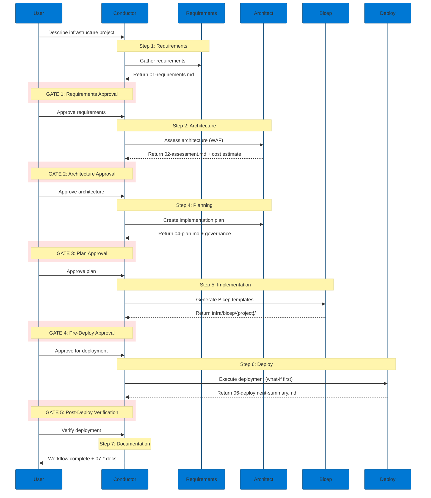

<!-- markdownlint-disable MD013 MD033 MD041 -->

<a id="readme-top"></a>

<!-- PROJECT SHIELDS -->

[![Contributors][contributors-shield]][contributors-url]
[![Forks][forks-shield]][forks-url]
[![Stargazers][stars-shield]][stars-url]
[![Issues][issues-shield]][issues-url]
[![MIT License][license-shield]][license-url]
[![Azure][azure-shield]][azure-url]

<!-- PROJECT LOGO -->
<br />
<div align="center">
  <a href="https://github.com/jonathan-vella/azure-agentic-infraops">
    
  </a>

  <h1 align="center">Agentic InfraOps</h1>

  <p align="center">
    <strong>A multi-agent orchestration system for Azure infrastructure development</strong>
    <br />
    <em>Requirements → Architecture → Plan → Code → Deploy → Documentation</em>
    <br />
    <br />
    <a href="#-quick-start"><strong>Quick Start »</strong></a>
    ·
    <a href="agent-output/">Sample Outputs</a>
    ·
    <a href="scenarios/">Scenarios</a>
    ·
    <a href="https://github.com/jonathan-vella/azure-agentic-infraops/issues/new?labels=bug">Report Bug</a>
  </p>
</div>

---

<details>
<summary><h2>What is Agentic InfraOps?</h2></summary>

Agentic InfraOps transforms how you build Azure infrastructure with AI agents.

Instead of context-switching between requirements gathering, architecture decisions, Bicep
authoring, and documentation, Agentic InfraOps provides a **structured 7-step workflow** that
coordinates specialized AI agents through a complete infrastructure development cycle:
**Requirements → Architecture → Design → Plan → Code → Deploy → Documentation**.

The system solves a critical challenge in AI-assisted infrastructure development: **maintaining
quality and compliance while moving quickly**. By enforcing Azure Well-Architected Framework (WAF)
alignment and Azure Verified Modules (AVM) at every phase, you get the speed of AI coding combined
with best practices in cloud engineering.

> Built upon patterns from [copilot-orchestra](https://github.com/ShepAlderson/copilot-orchestra)
> and [Copilot-Atlas](https://github.com/bigguy345/Github-Copilot-Atlas), adapted for Azure
> infrastructure workflows.

<p align="right">(<a href="#readme-top">back to top</a>)</p>

</details>

---

<details>
<summary><h2>Key Features</h2></summary>

### 🎭 Multi-Agent Workflow

The **InfraOps Conductor** orchestrates 7 specialized agents, each optimized for their specific
role in the infrastructure development lifecycle.

### 🏛️ WAF-Aligned Decisions

Every architecture decision is evaluated against the 5 pillars of the Azure Well-Architected
Framework: Security, Reliability, Performance, Cost Optimization, and Operational Excellence.

### 🔍 Preflight Validation

3 validation subagents (lint, what-if, review) provide quality gates before deployment—catching
issues early when they're cheap to fix.

### ⏸️ Mandatory Approval Gates

Built-in pause points for plan approval, pre-deployment review, and post-deployment verification
keep you in control of the infrastructure development process.

### 📋 Documentation Trail

Comprehensive artifacts at each phase (01-07) create an audit trail for reviewing all work
completed and decisions made.

### 💎 Context Conservation

The majority of work is done in dedicated subagents, each with its own context window and
dedicated prompt. This reduces hallucinations as the context fills up.

<p align="right">(<a href="#readme-top">back to top</a>)</p>

</details>

---

## Agent Interaction Flow

<div align="center">
  
</div>



<p align="right">(<a href="#readme-top">back to top</a>)</p>

---

<details>
<summary><h2>Architecture Overview</h2></summary>

The Agentic InfraOps system consists of specialized agents organized into three tiers:

### Primary Agent: The Conductor

| Agent | Persona | Role | Model |
|-------|---------|------|-------|
| **InfraOps Conductor** | 🎼 Maestro | Master orchestrator managing the complete 7-step workflow | Claude Sonnet 4.5 |

- Coordinates all specialized agents through handoffs
- Manages 5 mandatory approval gates
- Handles user interactions and pause points
- Enforces the Requirements → Deploy → Docs cycle

### Core Agents (7 Steps)

| Step | Agent | Persona | Role | Model |
|------|-------|---------|------|-------|
| 1 | `requirements` | 📜 Scribe | Captures infrastructure requirements | Claude Sonnet 4.5 |
| 2 | `architect` | 🏛️ Oracle | WAF assessment and design decisions | Claude Sonnet 4.5 |
| 3 | `design` | 🎨 Artisan | Diagrams and Architecture Decision Records | Claude Sonnet 4.5 |
| 4 | `bicep-plan` | 📐 Strategist | Implementation planning with governance | Claude Sonnet 4.5 |
| 5 | `bicep-code` | ⚒️ Forge | Generates AVM-first Bicep templates | Claude Sonnet 4.5 |
| 6 | `deploy` | 🚀 Envoy | Azure resource provisioning | Claude Sonnet 4.5 |
| 7 | — | 📚 — | As-built documentation (via skills) | — |

### Validation Subagents

| Subagent | Role | When Invoked |
|----------|------|--------------|
| `bicep-lint-subagent` | Syntax validation (bicep lint, bicep build) | Pre-deployment |
| `bicep-whatif-subagent` | Deployment preview (az deployment what-if) | Pre-deployment |
| `bicep-review-subagent` | Code review (AVM standards, security, naming) | Pre-deployment |

### Diagnostic Agent

| Agent | Persona | Role |
|-------|---------|------|
| `diagnose` | 🔍 Sentinel | Resource health assessment and troubleshooting |

<p align="right">(<a href="#readme-top">back to top</a>)</p>

</details>

---

<details>
<summary><h2>How It Works</h2></summary>

The Conductor agent follows a strict 7-step cycle for every infrastructure project:

### Step 1: Requirements (Scribe)

- **User Request** — You describe the Azure infrastructure you want to build
- **Captures Requirements** — `requirements` agent gathers functional, non-functional, and
  compliance requirements
- **Output** — `agent-output/{project}/01-requirements.md`

### Step 2: Architecture (Oracle)

- **WAF Assessment** — `architect` agent evaluates requirements against Well-Architected Framework
- **Cost Estimation** — Azure Pricing MCP provides real-time SKU pricing
- **Output** — `agent-output/{project}/02-architecture-assessment.md`

### Step 3: Design Artifacts (Artisan | Optional)

- **Architecture Diagrams** — `azure-diagrams` skill generates Python-based diagrams
- **Decision Records** — `azure-adr` skill creates Architecture Decision Records
- **Output** — `agent-output/{project}/03-des-*.md/.py/.png`

### Step 4: Planning (Strategist)

- **Governance Discovery** — Discovers Azure Policy constraints in target subscription
- **Implementation Plan** — `bicep-plan` agent creates detailed, phased implementation plan
- **GATE: Plan Approval** — User reviews and approves before implementation
- **Output** — `agent-output/{project}/04-implementation-plan.md`

### Step 5: Implementation (Forge)

- **Bicep Generation** — `bicep-code` agent creates AVM-first Bicep templates
- **Preflight Validation** — Lint, what-if, and review subagents validate code
- **GATE: Pre-Deploy** — User reviews validation results
- **Output** — `infra/bicep/{project}/` with `05-implementation-reference.md`

### Step 6: Deployment (Envoy)

- **Azure Provisioning** — `deploy` agent executes deployment with what-if preview
- **GATE: Post-Deploy** — User verifies deployed resources
- **Output** — `agent-output/{project}/06-deployment-summary.md`

### Step 7: Documentation

- **As-Built Suite** — `azure-workload-docs` skill generates comprehensive documentation
- **Output** — `agent-output/{project}/07-*.md` (design doc, runbook, DR plan, inventory)

<p align="right">(<a href="#readme-top">back to top</a>)</p>

</details>

---

<details>
<summary><h2>⚡ Quick Start</h2></summary>

### Prerequisites

| Requirement | Details |
|-------------|---------|
| 🐳 Docker Desktop | Or Podman, Colima, Rancher Desktop |
| 💻 VS Code | With [Dev Containers](https://marketplace.visualstudio.com/items?itemName=ms-vscode-remote.remote-containers) extension |
| 🤖 GitHub Copilot | Active subscription with Chat extension |
| ☁️ Azure subscription | Optional for learning, required for deployment |

### 1️⃣ Clone and Open

```bash
git clone https://github.com/jonathan-vella/azure-agentic-infraops.git
cd azure-agentic-infraops
code .
```

### 2️⃣ Start Dev Container

Press `F1` → **Dev Containers: Reopen in Container**

> ⏱️ First build takes 2-3 minutes. All tools are pre-installed.

### 3️⃣ Enable Custom Agent Subagents

> **⚠️ Required Setting**: In your VS Code **User Settings** (`Ctrl+,`), enable:
>
> ```json
> { "chat.customAgentInSubagent.enabled": true }
> ```
>
> Without this, the Conductor cannot delegate to specialized agents.

### 4️⃣ Start the Conductor

Press `Ctrl+Shift+I` → Select **InfraOps Conductor** from the agent dropdown

### 5️⃣ Try It

```
Create a web app with Azure App Service, Key Vault, and SQL Database
```

The Conductor will guide you through all 7 steps with approval gates. Say `yes` to continue, or
provide feedback to refine.

📖 **[Full Quick Start Guide →](docs/quickstart.md)**

<p align="right">(<a href="#readme-top">back to top</a>)</p>

</details>

---

<details>
<summary><h2>Usage Examples</h2></summary>

### Example: E-Commerce Platform

```
User: Create an e-commerce platform with AKS, Cosmos DB, and Redis caching

Conductor:
  ├─ @requirements → 01-requirements.md (functional, NFRs, compliance)
  ├─ @architect → 02-architecture-assessment.md (WAF analysis, cost estimate)
  │   └─ Azure Pricing MCP (real-time SKU pricing)
  ├─ azure-diagrams skill → 03-des-diagram.py/.png
  ├─ @bicep-plan → 04-implementation-plan.md (governance constraints)
  │
  │   [GATE 1: User approves plan]
  │
  ├─ @bicep-code → infra/bicep/ecommerce/
  │   ├─ @bicep-lint-subagent → Syntax validation ✓
  │   ├─ @bicep-whatif-subagent → What-if preview ✓
  │   └─ @bicep-review-subagent → AVM compliance ✓
  │
  │   [GATE 2: User approves pre-deployment]
  │
  ├─ @deploy → 06-deployment-summary.md
  │
  │   [GATE 3: User verifies deployment]
  │
  └─ azure-workload-docs skill → 07-*.md (design doc, runbook, DR plan)
```

### Direct Agent Invocation

You can also invoke agents directly for specific tasks:

```bash
# Gather requirements only
Ctrl+Shift+A → requirements → "Capture requirements for a static web app"

# WAF assessment only
Ctrl+Shift+A → architect → "Assess the requirements in 01-requirements.md"

# Diagnose existing resources
Ctrl+Shift+A → diagnose → "Check health of my App Service apps"
```

<p align="right">(<a href="#readme-top">back to top</a>)</p>

</details>

---

<details>
<summary><h2>Skills (Reusable Capabilities)</h2></summary>

10 skills provide reusable capabilities across agents:

| Skill | Purpose | Output |
|-------|---------|--------|
| `azure-diagrams` | Architecture diagrams (700+ Azure icons) | `.py` + `.png` |
| `azure-adr` | Architecture Decision Records | `03-des-adr-*.md` |
| `azure-workload-docs` | As-built documentation suite | `07-*.md` |
| `azure-deployment-preflight` | Pre-deployment validation | Validation report |
| `gh-cli` | GitHub CLI operations | — |
| `git-commit` | Conventional commit messages | — |
| `github-issues` | Issue management | — |
| `github-pull-requests` | PR creation and management | — |
| `orchestration-helper` | Workflow orchestration utilities | — |
| `make-skill-template` | Create new skills | — |

<p align="right">(<a href="#readme-top">back to top</a>)</p>

</details>

---

<details>
<summary><h2>Generated Artifacts</h2></summary>

### Workflow Artifacts

| Phase | Artifact | Description |
|-------|----------|-------------|
| 1 | `01-requirements.md` | Functional, non-functional, compliance requirements |
| 2 | `02-architecture-assessment.md` | WAF analysis, SKU recommendations, cost estimate |
| 3 | `03-des-*.md/.py/.png` | Diagrams, ADRs, cost estimates |
| 4 | `04-implementation-plan.md` | Phased implementation plan with governance |
| 4 | `04-governance-constraints.md` | Azure Policy discovery results |
| 5 | `05-implementation-reference.md` | Bicep module inventory and validation status |
| 6 | `06-deployment-summary.md` | Deployed resources and verification |
| 7 | `07-design-document.md` | Technical design documentation |
| 7 | `07-operations-runbook.md` | Day-2 operations procedures |
| 7 | `07-backup-dr-plan.md` | Backup and disaster recovery plan |
| 7 | `07-resource-inventory.md` | Complete resource inventory |

### Sample Outputs

Explore complete workflow outputs in [`agent-output/`](agent-output/):

| Project | Description | Highlights |
|---------|-------------|------------|
| [e2e-conductor-test](agent-output/e2e-conductor-test/) | End-to-end Conductor validation | Full 7-step workflow |
| [static-webapp](agent-output/static-webapp/) | Static Web App with Functions | Production-ready pattern |

<p align="right">(<a href="#readme-top">back to top</a>)</p>

</details>

---

<details>
<summary><h2>🧩 MCP Integration</h2></summary>

### Microsoft Azure MCP Server

The core enabler behind "agents with real Azure context":

| Feature | Description |
|---------|-------------|
| **RBAC-Aware** | Tools operate within your existing Azure permissions |
| **Broad Coverage** | 40+ Azure service areas: platform, monitoring, governance |
| **Day-0 to Day-2** | Discovery, validation, and troubleshooting workflows |

📖 **[Azure MCP Server →](https://github.com/microsoft/mcp/blob/main/servers/Azure.Mcp.Server/README.md)**

### 💰 Pricing MCP Add-on

Real-time Azure retail pricing for cost-aware SKU decisions. Pre-configured in this repo.

📖 **[Pricing MCP Documentation →](mcp/azure-pricing-mcp/)**

<p align="right">(<a href="#readme-top">back to top</a>)</p>

</details>

---

<details>
<summary><h2>📁 Project Structure</h2></summary>

```
├── 📁 .github/
│   ├── 📁 agents/             # 7 main agents + 3 validation subagents
│   │   ├── infraops-conductor.agent.md  # 🎼 Maestro - Master orchestrator
│   │   ├── requirements.agent.md        # 📜 Scribe - Requirements capture
│   │   ├── architect.agent.md           # 🏛️ Oracle - WAF assessment
│   │   ├── design.agent.md              # 🎨 Artisan - Diagrams/ADRs
│   │   ├── bicep-plan.agent.md          # 📐 Strategist - Planning
│   │   ├── bicep-code.agent.md          # ⚒️ Forge - Bicep generation
│   │   ├── deploy.agent.md              # 🚀 Envoy - Deployment
│   │   ├── diagnose.agent.md            # 🔍 Sentinel - Diagnostics
│   │   └── 📁 _subagents/               # Validation subagents
│   ├── 📁 instructions/       # Guardrails and coding standards
│   ├── 📁 skills/             # 10 reusable skills
│   └── 📁 templates/          # Artifact output templates
├── 📁 agent-output/           # Generated artifacts per project
├── 📁 docs/                   # Documentation and guides
├── 📁 infra/bicep/            # Generated Bicep templates
├── 📁 mcp/azure-pricing-mcp/  # 💰 Pricing MCP add-on
└── 📁 scenarios/              # 8 hands-on learning scenarios
```

<p align="right">(<a href="#readme-top">back to top</a>)</p>

</details>

---

<details>
<summary><h2>Configuration</h2></summary>

### VS Code Settings

**Required** (in devcontainer.json or User Settings):

```json
{
  "chat.customAgentInSubagent.enabled": true,
  "chat.agentFilesLocations": {
    ".github/agents": true,
    ".github/agents/_subagents": true
  },
  "chat.agentSkillsLocations": {
    ".github/skills": true
  }
}
```

**Recommended** (in .vscode/settings.json):

```json
{
  "github.copilot.chat.responsesApiReasoningEffort": "high",
  "chat.thinking.style": "detailed"
}
```

### Customizing Agents

Each agent is defined in a `.agent.md` file that you can modify:

1. **Adjust AI Model** — Change the `model` field in frontmatter
2. **Modify Instructions** — Edit the main section to change behavior
3. **Add Tools** — Extend the `tools` array for additional capabilities

<p align="right">(<a href="#readme-top">back to top</a>)</p>

</details>

---

<details>
<summary><h2>Best Practices</h2></summary>

1. **Use the Conductor for complete workflows** — Let it orchestrate the full 7-step cycle
2. **Review artifacts at each gate** — The approval points are designed for human oversight
3. **Leverage preflight validation** — Let the subagents catch issues before deployment
4. **Trust the WAF process** — The architect agent enforces best practices
5. **Commit frequently** — After each approved phase, commit the artifacts
6. **Delegate appropriately** — Use direct agent invocation for focused tasks

<p align="right">(<a href="#readme-top">back to top</a>)</p>

</details>

---

<details>
<summary><h2>🎯 Scenarios</h2></summary>

**8 hands-on scenarios** from beginner to advanced (15-45 min each):

| Level | Scenarios |
|-------|-----------|
| **Beginner** | Bicep baseline, diagrams as code |
| **Intermediate** | Documentation generation, service validation, troubleshooting, SBOM |
| **Advanced** | Full agentic workflow, async coding agent |

📖 **[Full Scenarios Guide →](scenarios/README.md)**

<p align="right">(<a href="#readme-top">back to top</a>)</p>

</details>

---

<details>
<summary><h2>📋 Requirements</h2></summary>

| Requirement | Details |
|-------------|---------|
| **VS Code** | With [GitHub Copilot](https://marketplace.visualstudio.com/items?itemName=GitHub.copilot) |
| **Dev Container** | [Docker Desktop](https://www.docker.com/products/docker-desktop/) or Codespaces |
| **Azure subscription** | For deployments (optional for learning) |

**Included in Dev Container:**

- ✅ Azure CLI with Bicep extension
- ✅ PowerShell 7+ and Python 3.10+
- ✅ All required VS Code extensions
- ✅ Pricing MCP add-on (auto-configured)
- ✅ Python diagrams library (auto-installed)

<p align="right">(<a href="#readme-top">back to top</a>)</p>

</details>

---

<details>
<summary><h2>🤝 Contributing</h2></summary>

Contributions are welcome! See [CONTRIBUTING.md](CONTRIBUTING.md) for guidelines.

<p align="right">(<a href="#readme-top">back to top</a>)</p>

</details>

---

<details>
<summary><h2>📄 License</h2></summary>

MIT License. See [LICENSE](LICENSE) for details.

<p align="right">(<a href="#readme-top">back to top</a>)</p>

</details>

---

<details>
<summary><h2>Acknowledgments</h2></summary>

This project builds upon the excellent work of:

- [copilot-orchestra](https://github.com/ShepAlderson/copilot-orchestra) by ShepAlderson —
  Foundation for multi-agent orchestration patterns
- [Github-Copilot-Atlas](https://github.com/bigguy345/Github-Copilot-Atlas) by bigguy345 —
  Inspiration for context conservation and parallel execution

<p align="right">(<a href="#readme-top">back to top</a>)</p>

</details>

---

<div align="center">
  <p>
    Made with ❤️ by <a href="https://github.com/jonathan-vella">Jonathan Vella</a>
  </p>
  <p>
    <a href="https://github.com/jonathan-vella/azure-agentic-infraops">
      
    </a>
  </p>
  <p>
    🔗 <strong>Shortlink</strong>: <a href="https://aka.ms/agenticinfraops">aka.ms/agenticinfraops</a>
  </p>
</div>

<!-- MARKDOWN LINKS & IMAGES -->

[contributors-shield]: https://img.shields.io/github/contributors/jonathan-vella/azure-agentic-infraops.svg?style=for-the-badge
[contributors-url]: https://github.com/jonathan-vella/azure-agentic-infraops/graphs/contributors
[forks-shield]: https://img.shields.io/github/forks/jonathan-vella/azure-agentic-infraops.svg?style=for-the-badge
[forks-url]: https://github.com/jonathan-vella/azure-agentic-infraops/network/members
[stars-shield]: https://img.shields.io/github/stars/jonathan-vella/azure-agentic-infraops.svg?style=for-the-badge
[stars-url]: https://github.com/jonathan-vella/azure-agentic-infraops/stargazers
[issues-shield]: https://img.shields.io/github/issues/jonathan-vella/azure-agentic-infraops.svg?style=for-the-badge
[issues-url]: https://github.com/jonathan-vella/azure-agentic-infraops/issues
[license-shield]: https://img.shields.io/github/license/jonathan-vella/azure-agentic-infraops.svg?style=for-the-badge
[license-url]: https://github.com/jonathan-vella/azure-agentic-infraops/blob/main/LICENSE
[azure-shield]: https://img.shields.io/badge/Azure-Ready-0078D4?style=for-the-badge&logo=microsoftazure&logoColor=white
[azure-url]: https://azure.microsoft.com
