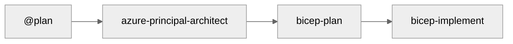

# Agentic InfraOps - Version History

## Semantic Versioning

This repository follows [Semantic Versioning 2.0.0](https://semver.org/):

- **MAJOR.MINOR.PATCH** (e.g., 1.2.3)
- **MAJOR**: Breaking changes to workflow or agents
- **MINOR**: New agents, significant features
- **PATCH**: Bug fixes, documentation updates

---

## Version 3.2.0 (2025-12-07) - Character System & Scenario Restructure 🎭

### Summary

Comprehensive scenario restructure with complete character system for storytelling. All 11 scenarios
now have unique personas with detailed profiles, eliminating character collisions and enabling
compelling demo narratives.

### Added

- **Character Reference Card** (`docs/presenter-toolkit/character-reference.md`)
  - All 11 personas with detailed profiles and demo hooks
  - Character selection guide by audience type
  - Time savings table by character
  - Storytelling tips and narrative arc guidance
- **New Characters**: Jennifer Chen (S03), Carlos Mendez (S04)
- **"Meet [Character]" sections** in S03 and S04 READMEs

### Changed

- **Scenario Restructure**: Sequential S01-S11 numbering (fixed duplicate S04)
- **Character Collision Resolution**:
  - S03: Sarah Chen → Jennifer Chen (Solutions Architect at Meridian Systems)
  - S07: Sarah Chen → Maya Patel (On-Call SRE at RetailMax)
  - S09: Marcus Chen → David Kim (Solutions Architect at TechVentures)
  - Secondary stakeholders renamed across scenarios
- **Presenter Toolkit**: Added character-reference link, updated to S01-S11
- **scenarios/README.md**: Complete rewrite with all characters and time savings

### Character Matrix

| Scenario | Character       | Role                           |
| -------- | --------------- | ------------------------------ |
| S01      | Elena Rodriguez | Cloud Infrastructure Engineer  |
| S02      | Jordan Martinez | Senior Infrastructure Engineer |
| S03      | Jennifer Chen   | Solutions Architect            |
| S04      | Carlos Mendez   | E-Commerce Architect           |
| S05      | Priya Sharma    | Senior Technical Writer        |
| S06      | Marcus Chen     | Senior QA Engineer             |
| S07      | Maya Patel      | On-Call SRE                    |
| S08      | Sarah Chen      | Security Engineer              |
| S09      | David Kim       | Solutions Architect            |
| S10      | Alex Petrov     | Cloud Operations Engineer      |
| S11      | Various         | Quick demos                    |

---

## Version 3.1.0 (2025-12-03) - Agentic InfraOps Rebrand 🚀

### Summary

Major rebrand from "GitHub Copilot Demo" to **Agentic InfraOps**. New identity emphasizes
AI-agent-driven Azure infrastructure development with Well-Architected alignment and Azure
Verified Modules.

### Changed

- **Project Identity**: Rebranded to "Agentic InfraOps"
- **Punch Line**: "Azure infrastructure engineered by agents. Verified. Well-Architected. Deployable."
- **Repository Name**: `github-copilot-demo` → `azure-agentic-infraops`
- **Folder Rename**: `demos/` → `scenarios/`, `demo-output/` → `scenario-output/`
- **All Documentation**: Updated to reflect new branding and messaging
- **Custom Badge**: New Agentic InfraOps branded badge

### Highlights

- Coordinated AI agents transform requirements into deploy-ready infrastructure
- Real-time Azure pricing via MCP server integration
- Aligned with Azure Well-Architected Framework best practices
- Uses Azure Verified Modules (AVM) for Bicep templates

---

## Version 2.1.0 (2025-12-03) - MCP Integration & E-Commerce Demo 💰

### Summary

Enhanced MCP integration with prominent featuring across documentation. Completed E-Commerce
platform deployment with Azure Policy compliance fixes. Updated all App Service Plans to P1v4 SKU.

### Added

- **Azure Pricing MCP Integration**: Real-time pricing during architecture phase
- **E-Commerce Demo**: Complete 61-resource PCI-DSS compliant infrastructure
- **Azure Policy Compliance Section**: Added to instruction files for common blockers
- **Enhanced Workflow Diagram**: Side activities (MCP, diagrams) during architect phase

### Changed

- **App Service Plan SKU**: Upgraded from P1v2/P1v3 to P1v4 for zone redundancy support
- **Monthly Cost Estimates**: Updated to ~$2,212/mo (P1v4 pricing)
- **README.md**: Complete rewrite with MCP badge and dedicated section
- **WORKFLOW.md**: Restructured with MCP integration documentation
- **Workflow Visualization**: 6-step with optional integrations pattern

### Fixed

- **WAF Policy Naming**: Alphanumeric only (no hyphens)
- **Functions Storage**: Identity-based connections for Azure Policy compliance
- **SQL Diagnostic Settings**: Removed unsupported `SQLSecurityAuditEvents` category
- **Service Bus Subnet**: Fixed private endpoint subnet reference

---

## Version 2.0.0 (2025-12-01) - Workflow Focus 🔄

### Summary

Repository restructured to focus exclusively on the 6-step agent workflow for Azure
infrastructure development. Removed legacy scenarios and resources to provide a clean,
focused experience.

### Changed

- **Repository Focus**: Now centered on the 6-step agent workflow
- **Simplified Structure**: Removed scenarios, resources folders
- **Clean Slate**: Empty `demos/`, `infra/bicep/`, `docs/adr/`, `docs/diagrams/` ready for generated content

### Core Components

#### Custom Agents (6 agents)

- **azure-principal-architect** - WAF assessment (NO CODE)
- **bicep-plan** - Implementation planning with AVM modules
- **bicep-implement** - Bicep code generation
- **diagram-generator** - Python architecture diagrams
- **adr-generator** - Architecture Decision Records
- **infrastructure-specialist** - Unified agent (optional)

#### Documentation

- `docs/workflow/WORKFLOW.md` - Complete workflow guide
- `.github/copilot-instructions.md` - AI agent guidance
- `README.md` - Quick start and overview

### Workflow



---

## Version Schema

```text
MAJOR.MINOR.PATCH

MAJOR (Breaking Changes):
- Workflow architecture changes
- Agent API changes

MINOR (New Features):
- New agents
- Significant documentation additions

PATCH (Improvements):
- Bug fixes
- Documentation updates
```

---

**Current Version**: **3.2.0**
**Release Date**: December 7, 2025
**Status**: Production Ready ✅
