# Azure Cost Estimate: agent-testing

**Generated**: 2026-02-04
**Region**: swedencentral
**Environment**: Development
**MCP Tools Used**: azure_price_search, azure_cost_estimate
**Architecture Reference**: [02-architecture-assessment.md](./02-architecture-assessment.md)

> [!NOTE]
> 📚 See [documentation-styling.md](../../.github/agents/_shared/documentation-styling.md) for visual standards.

## 💰 Cost At-a-Glance

> **Monthly Total: ~$42** | Annual: ~$504
>
> ```
> Budget: ~$200/month (soft) | Utilization: 21% ($42 of $200)
> ```
>
> | Status            | Indicator                      |
> | ----------------- | ------------------------------ |
> | Cost Trend        | ➡️ Stable                      |
> | Savings Available | 💰 ~$50/year with Reserved SQL |
> | Compliance        | ✅ GDPR aligned (EU regions)   |

## ✅ Decision Summary

- ✅ Approved: Basic SKUs for all services, consumption-based Container Apps
- ⏳ Deferred: Premium SKUs, zone redundancy, private endpoints
- 🔁 Redesign Trigger: Production promotion, >10 concurrent users, HA requirement

**Confidence**: High | **Expected Variance**: ±15% (usage-based services may vary)

## 🔁 Requirements → Cost Mapping

| Requirement         | Architecture Decision     | Cost Impact    | Mandatory |
| ------------------- | ------------------------- | -------------- | --------- |
| Dev Environment     | Basic SKUs everywhere     | -$150/month 📉 | Yes       |
| GDPR Compliance     | swedencentral region      | +$0            | Yes       |
| Monitoring Required | LA + App Insights         | +$7/month      | Yes       |
| SQL Database        | Basic (5 DTUs)            | +$5/month      | Yes       |
| Static Web App      | Standard (ARM limitation) | +$9/month 📈   | Yes       |

> [!TIP]
> 💡 Static Web App `Free` tier is not available via ARM deployment. Using `Standard` adds ~$9/month.

## 📊 Top 5 Cost Drivers

| Rank | Resource              | Monthly Cost | % of Total | Trend |
| ---- | --------------------- | ------------ | ---------- | ----- |
| 1️⃣   | App Service Plan (B1) | $13.14       | 31%        | ➡️    |
| 2️⃣   | Static Web App        | $9.00        | 21%        | ➡️    |
| 3️⃣   | Container Apps        | $5.00        | 12%        | ⬆️    |
| 4️⃣   | SQL Database (Basic)  | $4.99        | 12%        | ➡️    |
| 5️⃣   | Log Analytics         | $5.00        | 12%        | ⬆️    |

> [!TIP]
> 💡 **Quick Win**: Deallocate App Service during non-working hours to save ~$6/month.

## Architecture Overview

### Cost Distribution

```mermaid
%%{init: {'theme':'base','themeVariables':{'pie1':'#0078D4','pie2':'#107C10','pie3':'#5C2D91','pie4':'#D83B01','pie5':'#FFB900','pie6':'#00BCF2'}}}%%
pie showData
    title Monthly Cost Distribution ($)
    "💻 App Service Plan" : 13
    "🌐 Static Web App" : 9
    "💻 Container Apps" : 5
    "💾 SQL Database" : 5
    "📊 Log Analytics" : 5
    "🔐 Other" : 5
```



### Key Design Decisions Affecting Cost

| Decision                   | Cost Impact | Alternative                  | Savings    |
| -------------------------- | ----------- | ---------------------------- | ---------- |
| Basic App Service Plan     | $13/month   | Free (F1) - no custom domain | $13/month  |
| Standard Static Web App    | $9/month    | Free (Portal only)           | $9/month   |
| Basic SQL Database         | $5/month    | Serverless (variable)        | Variable   |
| Consumption Container Apps | $5/month    | Premium (fixed)              | -$20/month |

## 💡 Optimization Recommendations

### Immediate Actions

| Action                            | Savings   | Risk Level |
| --------------------------------- | --------- | ---------- |
| ⏸️ Stop App Service when idle     | ~$6/month | Low        |
| 📊 Reduce LA retention to 30 days | ~$1/month | Low        |

### Future Considerations

| Action                   | Savings   | When to Apply        |
| ------------------------ | --------- | -------------------- |
| 🔒 Reserved SQL (1-year) | ~$50/year | If running >6 months |
| 💻 Dev/Test subscription | ~20%      | If available         |

> [!WARNING]
> Do not use Reserved Instances for ephemeral dev/test environments.

## 📈 Cost Trend Analysis

| Period    | Estimated Cost | Notes                   |
| --------- | -------------- | ----------------------- |
| Week 1    | $11            | Initial deployment      |
| Month 1   | $42            | Steady state            |
| Quarter 1 | $126           | If running continuously |
| Year 1    | $504           | Not recommended for dev |

## Detailed Cost Breakdown

### Assumptions

- Hours: 730 hours/month (24x7)
- Network egress: <1GB/month (minimal)
- Storage growth: Negligible (<100MB)
- Log ingestion: <1GB/month

### Line Items

| Category      | Service              | SKU / Meter  | Quantity     | Est. Monthly |
| ------------- | -------------------- | ------------ | ------------ | ------------ |
| 📊 Monitoring | Log Analytics        | PerGB2018    | <1 GB        | $5.00        |
| 📊 Monitoring | Application Insights | Included     | -            | $0.00        |
| 🔐 Security   | Key Vault            | Standard     | <100 ops     | $0.50        |
| 📦 Storage    | Storage Account      | Standard_LRS | <1 GB        | $0.50        |
| 💻 Compute    | App Service Plan     | B1           | 1 instance   | $13.14       |
| 💻 Compute    | App Service          | -            | Included     | $0.00        |
| 💻 Compute    | Container App Env    | Consumption  | -            | $0.00        |
| 💻 Compute    | Container App        | Consumption  | 1M requests  | $5.00        |
| 💾 Data       | SQL Server           | -            | -            | $0.00        |
| 💾 Data       | SQL Database         | Basic        | 5 DTU        | $4.99        |
| 📨 Messaging  | Service Bus          | Basic        | <1K messages | $0.50        |
| 🌐 Web        | Static Web App       | Standard     | 1 site       | $9.00        |
| **Total**     |                      |              |              | **~$42.00**  |

<details>
<summary>📋 Regional Pricing Notes</summary>

| Region        | Price Modifier | Used For       |
| ------------- | -------------- | -------------- |
| swedencentral | Standard       | All resources  |
| westeurope    | Standard       | Static Web App |

Static Web App is not available in swedencentral, deployed to westeurope with no
additional cross-region cost for the service itself.

</details>

### Notes

- 💡 Consumption-based services (Container Apps, Log Analytics) will vary with usage
- ⚠️ Static Web App Standard tier required for ARM deployment
- ✅ All costs within budget constraints

---

## References

| Topic                    | Link                                                                                                                   |
| ------------------------ | ---------------------------------------------------------------------------------------------------------------------- |
| Azure Pricing Calculator | [Calculator](https://azure.microsoft.com/pricing/calculator/)                                                          |
| Cost Management          | [Overview](https://learn.microsoft.com/azure/cost-management-billing/costs/overview-cost-management)                   |
| Reserved Instances       | [Reservations](https://learn.microsoft.com/azure/cost-management-billing/reservations/save-compute-costs-reservations) |
| WAF Cost Optimization    | [Checklist](https://learn.microsoft.com/azure/well-architected/cost-optimization/checklist)                            |
