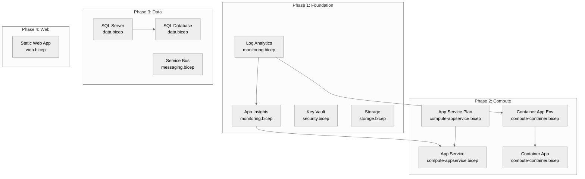

# Step 4: Implementation Plan - agent-testing

> Generated by bicep-plan agent | 2025-02-04

> [!NOTE]
> 📚 See [documentation-styling.md](../../.github/agents/_shared/documentation-styling.md) for visual standards.

## Overview

This implementation plan defines the Bicep infrastructure for the **agent-testing** project - a comprehensive test environment for validating the agentic infrastructure workflow. The deployment includes monitoring, security, storage, compute (App Service + Container Apps), data (SQL Database), messaging (Service Bus), and web (Static Web App) components.

### Governance Alignment

This plan complies with governance constraints discovered in [04-governance-constraints.md](./04-governance-constraints.md).

Key constraints applied:

- GDPR compliance (EU General Data Protection Regulation 2016/679)
- PCI DSS v4 alignment
- Azure Security Center data protection
- Azure AD-only authentication for SQL (no SQL passwords)

---

## Resource Inventory

| Resource             | Type                                     | SKU          | AVM Status | Region        | Region Notes                       | Dependencies      |
| -------------------- | ---------------------------------------- | ------------ | ---------- | ------------- | ---------------------------------- | ----------------- |
| Log Analytics        | Microsoft.OperationalInsights/workspaces | PerGB2018    | ✅ AVM     | swedencentral | -                                  | -                 |
| Application Insights | Microsoft.Insights/components            | -            | ✅ AVM     | swedencentral | -                                  | Log Analytics     |
| Key Vault            | Microsoft.KeyVault/vaults                | Standard     | ✅ AVM     | swedencentral | -                                  | -                 |
| Storage Account      | Microsoft.Storage/storageAccounts        | Standard_LRS | ✅ AVM     | swedencentral | -                                  | -                 |
| App Service Plan     | Microsoft.Web/serverFarms                | B1           | ✅ AVM     | swedencentral | -                                  | -                 |
| App Service          | Microsoft.Web/sites                      | -            | ✅ AVM     | swedencentral | -                                  | ASP, App Insights |
| Container App Env    | Microsoft.App/managedEnvironments        | Consumption  | ✅ AVM     | swedencentral | -                                  | Log Analytics     |
| Container App        | Microsoft.App/containerApps              | -            | ✅ AVM     | swedencentral | -                                  | Container App Env |
| SQL Server           | Microsoft.Sql/servers                    | -            | ✅ AVM     | swedencentral | -                                  | -                 |
| SQL Database         | Microsoft.Sql/servers/databases          | Basic        | ✅ AVM     | swedencentral | -                                  | SQL Server        |
| Service Bus          | Microsoft.ServiceBus/namespaces          | Basic        | ✅ AVM     | swedencentral | -                                  | -                 |
| Static Web App       | Microsoft.Web/staticSites                | Free         | ✅ AVM     | westeurope    | ⚠️ Only specific regions supported | -                 |

---

## Module Structure

```
infra/bicep/agent-testing/
├── main.bicep              # Orchestration entry point
├── main.bicepparam         # Parameter file for deployment
├── deploy.ps1              # Deployment script with what-if support
└── modules/
    ├── monitoring.bicep    # Log Analytics + App Insights
    ├── security.bicep      # Key Vault
    ├── storage.bicep       # Storage Account
    ├── compute-appservice.bicep  # ASP + App Service
    ├── compute-container.bicep   # Container Apps Env + Container App
    ├── data.bicep          # SQL Server + Database
    ├── messaging.bicep     # Service Bus
    └── web.bicep           # Static Web App
```

---

## Implementation Tasks

### Task 1: main.bicep (Orchestration)

**Purpose**: Main entry point that orchestrates all module deployments

**Parameters**:

- `location` (string, default: 'swedencentral') - Azure region
- `environment` (string, default: 'dev') - Environment name
- `projectName` (string, default: 'agenttest') - Project identifier
- `owner` (string) - Resource owner
- `sqlAdminGroupObjectId` (string) - Azure AD group OID for SQL admin
- `sqlAdminGroupName` (string) - Azure AD group name for SQL admin

**Variables**:

- `uniqueSuffix = uniqueString(resourceGroup().id)` - Unique suffix for globally unique names
- `regionAbbr = 'swc'` - Region abbreviation for naming
- `tags` - Common tags applied to all resources

**Modules Called** (in order):

1. monitoring.bicep (Phase 1: Foundation)
2. security.bicep (Phase 1: Foundation)
3. storage.bicep (Phase 1: Foundation)
4. compute-appservice.bicep (Phase 2: Compute)
5. compute-container.bicep (Phase 2: Compute)
6. data.bicep (Phase 3: Data)
7. messaging.bicep (Phase 3: Data)
8. web.bicep (Phase 4: Web)

---

### Task 2: modules/monitoring.bicep

**AVM Modules**:

- `br/public:avm/res/operational-insights/workspace:0.15.0`
- `br/public:avm/res/insights/component:0.7.1`

**Resources**:

- Log Analytics Workspace (`log-agenttest-dev-{suffix}`)
- Application Insights (`appi-agenttest-dev-{suffix}`)

**Key Configuration**:

```bicep
// Log Analytics - NOTE: dailyQuotaGb must be STRING type
dailyQuotaGb: '1'  // NOT int!
retentionInDays: 30
skuName: 'PerGB2018'

// App Insights
kind: 'web'
applicationType: 'web'
```

**Outputs**:

- `logAnalyticsWorkspaceId`
- `logAnalyticsWorkspaceName`
- `appInsightsConnectionString`
- `appInsightsInstrumentationKey`

---

### Task 3: modules/security.bicep

**AVM Module**: `br/public:avm/res/key-vault/vault:0.13.3`

**Resources**:

- Key Vault (`kv-{short}-{env}-{suffix}` - max 24 chars)

**Key Configuration**:

```bicep
sku: 'standard'
enableRbacAuthorization: true
enableSoftDelete: true
softDeleteRetentionInDays: 90
enablePurgeProtection: true
```

**Outputs**:

- `keyVaultName`
- `keyVaultUri`
- `keyVaultResourceId`

---

### Task 4: modules/storage.bicep

**AVM Module**: `br/public:avm/res/storage/storage-account:0.31.0`

**Resources**:

- Storage Account (`st{name}{env}{suffix}` - no hyphens, max 24 chars)

**Key Configuration**:

```bicep
kind: 'StorageV2'
skuName: 'Standard_LRS'
allowBlobPublicAccess: false
supportsHttpsTrafficOnly: true
minimumTlsVersion: 'TLS1_2'
allowSharedKeyAccess: false  // Identity-based access only
```

**Outputs**:

- `storageAccountName`
- `storageAccountId`
- `primaryBlobEndpoint`

---

### Task 5: modules/compute-appservice.bicep

**AVM Modules**:

- `br/public:avm/res/web/serverfarm:0.6.0`
- `br/public:avm/res/web/site:0.21.0`

**Resources**:

- App Service Plan (`asp-agenttest-dev-swc`)
- App Service (`app-agenttest-dev-swc`)

**Key Configuration**:

```bicep
// App Service Plan
skuName: 'B1'
skuCapacity: 1
reserved: false  // Windows

// App Service
kind: 'app'
httpsOnly: true
managedIdentity: { systemAssigned: true }
siteConfig: {
  appSettings: [
    {
      name: 'APPLICATIONINSIGHTS_CONNECTION_STRING'
      value: appInsightsConnectionString
    }
  ]
}
```

**Outputs**:

- `appServicePlanId`
- `appServiceHostname`
- `appServicePrincipalId`

---

### Task 6: modules/compute-container.bicep

**AVM Modules**:

- `br/public:avm/res/app/managed-environment:0.11.3`
- `br/public:avm/res/app/container-app:0.20.0`

**Resources**:

- Container Apps Environment (`cae-agenttest-dev-swc`)
- Container App (`ca-agenttest-dev-swc`)

**Key Configuration**:

```bicep
// Container Apps Environment
// NOTE: Use appLogsConfiguration, NOT logAnalyticsWorkspaceResourceId
appLogsConfiguration: {
  destination: 'azure-monitor'
}

// Container App
// NOTE: Use scaleSettings object, NOT flat scaleMinReplicas/scaleMaxReplicas
scaleSettings: {
  minReplicas: 0
  maxReplicas: 3
}
containers: [
  {
    name: 'hello'
    image: 'mcr.microsoft.com/k8se/quickstart:latest'
    resources: { cpu: '0.25', memory: '0.5Gi' }
  }
]
```

**Outputs**:

- `containerAppEnvId`
- `containerAppFqdn`

---

### Task 7: modules/data.bicep

**AVM Module**: `br/public:avm/res/sql/server:0.21.1`

**Resources**:

- SQL Server (`sql-agenttest-dev-swc-{suffix}`)
- SQL Database (`sqldb-agenttest-dev`)

**Key Configuration**:

```bicep
// SQL Server
administrators: {
  administratorType: 'ActiveDirectory'
  azureADOnlyAuthentication: true  // Required by governance
  login: sqlAdminGroupName
  principalType: 'Group'
  sid: sqlAdminGroupObjectId
  tenantId: tenant().tenantId
}
minimalTlsVersion: '1.2'
publicNetworkAccess: 'Enabled'  // For dev - disable in prod

// SQL Database
// NOTE: Use sku object, NOT flat skuName/skuTier
// NOTE: Include availabilityZone: -1 for no zone redundancy
databases: [
  {
    name: 'sqldb-agenttest-dev'
    sku: {
      name: 'Basic'
      tier: 'Basic'
    }
    availabilityZone: -1  // Required parameter
    maxSizeBytes: 2147483648  // 2GB
  }
]
```

**Outputs**:

- `sqlServerFqdn`
- `sqlServerName`
- `sqlDatabaseName`

---

### Task 8: modules/messaging.bicep

**AVM Module**: `br/public:avm/res/service-bus/namespace:0.16.1`

**Resources**:

- Service Bus Namespace (`sb-agenttest-dev-swc-{suffix}`)

**Key Configuration**:

```bicep
skuObject: {
  name: 'Basic'
}
minimumTlsVersion: '1.2'
disableLocalAuth: false  // Basic tier doesn't support identity-only
```

**Outputs**:

- `serviceBusNamespaceFqdn`
- `serviceBusNamespaceId`

---

### Task 9: modules/web.bicep

**AVM Module**: `br/public:avm/res/web/static-site:0.9.3`

**Resources**:

- Static Web App (`stapp-agenttest-dev-swc`)

**Key Configuration**:

```bicep
// CRITICAL: Static Web Apps only support specific regions
// Must hardcode location, NOT use the location parameter
var staticWebAppLocation = 'westeurope'  // NOT swedencentral!

sku: 'Free'
allowConfigFileUpdates: true
stagingEnvironmentPolicy: 'Enabled'
```

**Outputs**:

- `staticWebAppHostname`
- `staticWebAppId`

---

### Task 10: deploy.ps1 (Deployment Script)

**Features**:

- Parameter validation
- Bicep lint/build verification
- What-If preview mode
- Deployment execution with error handling
- Output display

---

## Dependency Graph



---

## Naming Conventions

| Resource Type     | Pattern                                 | Example                      |
| ----------------- | --------------------------------------- | ---------------------------- |
| Resource Group    | `rg-{project}-{env}`                    | `rg-agenttest-dev`           |
| Log Analytics     | `log-{project}-{env}-{suffix}`          | `log-agenttest-dev-abc12`    |
| App Insights      | `appi-{project}-{env}-{suffix}`         | `appi-agenttest-dev-abc12`   |
| Key Vault         | `kv-{short}-{env}-{suffix}` (≤24)       | `kv-agenttes-dev-abc12`      |
| Storage Account   | `st{name}{env}{suffix}` (no -)          | `stagenttestdevabc12`        |
| App Service Plan  | `asp-{project}-{env}-{region}`          | `asp-agenttest-dev-swc`      |
| App Service       | `app-{project}-{env}-{region}`          | `app-agenttest-dev-swc`      |
| Container App Env | `cae-{project}-{env}-{region}`          | `cae-agenttest-dev-swc`      |
| Container App     | `ca-{project}-{env}-{region}`           | `ca-agenttest-dev-swc`       |
| SQL Server        | `sql-{project}-{env}-{region}-{suffix}` | `sql-agenttest-dev-swc-abc1` |
| SQL Database      | `sqldb-{project}-{env}`                 | `sqldb-agenttest-dev`        |
| Service Bus       | `sb-{project}-{env}-{region}-{suffix}`  | `sb-agenttest-dev-swc-abc1`  |
| Static Web App    | `stapp-{project}-{env}-{region}`        | `stapp-agenttest-dev-swc`    |

---

## Security Configuration

### Required Tags (All Resources)

```bicep
tags: {
  Environment: 'dev'
  ManagedBy: 'Bicep'
  Project: 'agent-testing'
  Owner: '{owner}'
}
```

### Security Defaults

| Setting                     | Value           | Applied To       |
| --------------------------- | --------------- | ---------------- |
| `supportsHttpsTrafficOnly`  | `true`          | Storage          |
| `minimumTlsVersion`         | `TLS1_2`        | Storage, SQL, SB |
| `allowBlobPublicAccess`     | `false`         | Storage          |
| `azureADOnlyAuthentication` | `true`          | SQL Server       |
| `enableRbacAuthorization`   | `true`          | Key Vault        |
| `httpsOnly`                 | `true`          | App Service      |
| `managedIdentity`           | System-assigned | App Service      |

---

## Estimated Implementation Time

| Phase      | Tasks                             | Duration     |
| ---------- | --------------------------------- | ------------ |
| Phase 1    | Foundation (monitoring, security) | 30 min       |
| Phase 2    | Compute (App Service, Container)  | 45 min       |
| Phase 3    | Data (SQL, Service Bus)           | 30 min       |
| Phase 4    | Web (Static Web App)              | 15 min       |
| Validation | bicep build, lint, what-if        | 15 min       |
| **Total**  |                                   | **~2.5 hrs** |

---

## Approval Gate

**📋 Implementation Plan Complete**

- **Resources**: 12 Azure resources identified
- **AVM Modules**: 10 modules specified (all with ✅ AVM status)
- **Phases**: 4 implementation phases
- **Region Notes**: Static Web App requires `westeurope` (not swedencentral)

**Known AVM Pitfalls Documented**:

- ✅ Log Analytics `dailyQuotaGb` must be string type
- ✅ Container App Env uses `appLogsConfiguration` object
- ✅ Container App uses `scaleSettings` object
- ✅ SQL Database uses `sku` object + `availabilityZone: -1`
- ✅ Static Web App location hardcoded to `westeurope`

**Do you approve this implementation plan?**

- Reply **"yes"** or **"approve"** to proceed to Bicep code generation
- Reply with **feedback** to refine the plan
- Reply **"no"** to return to architecture review

---

## References

> [!NOTE]
> 📚 The following Microsoft Learn resources inform this implementation.

| Topic                  | Link                                                                                                                  |
| ---------------------- | --------------------------------------------------------------------------------------------------------------------- |
| Azure Verified Modules | [AVM Index](https://aka.ms/avm/index)                                                                                 |
| Bicep Best Practices   | [Documentation](https://learn.microsoft.com/azure/azure-resource-manager/bicep/best-practices)                        |
| CAF Naming Conventions | [Naming Rules](https://learn.microsoft.com/azure/cloud-adoption-framework/ready/azure-best-practices/resource-naming) |

---

_Implementation plan for agent-testing infrastructure._
