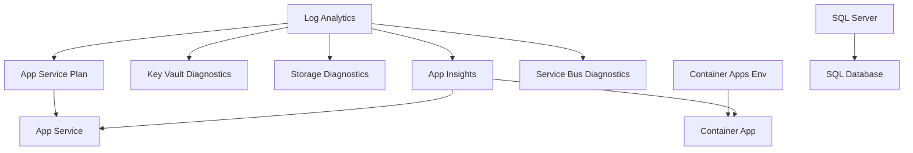

# Step 7: Resource Inventory - agent-testing

> Generated by azure-workload-docs skill | 2026-02-04
> **Source**: Azure Resource Graph query on rg-agenttest-dev

> [!NOTE]
> 📚 See [documentation-styling.md](../../.github/agents/_shared/documentation-styling.md) for visual standards.

## Summary

| Metric                     | Value                                        |
| -------------------------- | -------------------------------------------- |
| **Resource Group**         | rg-agenttest-dev                             |
| **Subscription**           | noalz (00858ffc-dded-4f0f-8bbf-e17fff0d47d9) |
| **Primary Region**         | swedencentral                                |
| **Total Resources**        | 14 (excluding system databases)              |
| **Estimated Monthly Cost** | ~$180-220 USD                                |

## Resource Listing

| Resource Type              | Name                           | SKU/Tier     | Location      | Purpose                            |
| -------------------------- | ------------------------------ | ------------ | ------------- | ---------------------------------- |
| Log Analytics Workspace    | log-agenttest-dev-swc-rqze4t   | PerGB2018    | swedencentral | Centralized logging and monitoring |
| Application Insights       | appi-agenttest-dev-swc-rqze4t  | -            | swedencentral | Application performance monitoring |
| Key Vault                  | kv-agenttes-dev-rqze4t         | Standard     | swedencentral | Secrets and certificate management |
| Storage Account            | stagenttestdevrqze4t           | Standard_LRS | swedencentral | General-purpose storage            |
| App Service Plan           | asp-agenttest-dev-swc-rqze4t   | B1 (Linux)   | swedencentral | Web app hosting plan               |
| App Service                | app-agenttest-dev-swc-rqze4t   | B1           | swedencentral | .NET 8 web application             |
| Container Apps Environment | cae-agenttest-dev-swc-rqze4t   | Consumption  | swedencentral | Container hosting environment      |
| Container App              | ca-agenttest-dev-swc-rqze4t    | Consumption  | swedencentral | Hello world container              |
| SQL Server                 | sql-agenttest-dev-swc-rqze4t   | v12.0        | swedencentral | Azure SQL Database server          |
| SQL Database               | sqldb-agenttest-dev            | Basic (2GB)  | swedencentral | Application database               |
| Service Bus Namespace      | sb-agenttest-dev-swc-rqze4t    | Basic        | swedencentral | Message queuing service            |
| Static Web App             | stapp-agenttest-dev-weu-rqze4t | Standard     | westeurope    | Static website hosting             |

## Resource Configuration Details

### Monitoring Resources

| Resource             | Configuration              | Retention |
| -------------------- | -------------------------- | --------- |
| Log Analytics        | PerGB2018, 1GB daily quota | 30 days   |
| Application Insights | Web application type       | 30 days   |

### Compute Resources

| Resource           | Configuration              | Scale          |
| ------------------ | -------------------------- | -------------- |
| App Service Plan   | B1 Linux                   | 1 instance     |
| App Service        | .NET 8, HTTPS only         | Manual scaling |
| Container Apps Env | Consumption, Azure Monitor | Auto-scale 0-3 |
| Container App      | 0.25 vCPU, 0.5GB RAM       | Scale to zero  |

### Data Resources

| Resource        | Configuration               | Backup             |
| --------------- | --------------------------- | ------------------ |
| SQL Server      | Azure AD-only auth, TLS 1.2 | Azure-managed      |
| SQL Database    | Basic tier, 2GB             | Local redundancy   |
| Storage Account | Standard_LRS, HTTPS only    | Soft delete 7 days |
| Service Bus     | Basic tier, 1 queue         | -                  |

### Security Resources

| Resource  | Configuration          | Access              |
| --------- | ---------------------- | ------------------- |
| Key Vault | Standard, RBAC enabled | Soft delete enabled |

## Tags Applied

All resources include these tags:

| Tag            | Value         |
| -------------- | ------------- |
| Environment    | dev           |
| ManagedBy      | Bicep         |
| Project        | agenttest     |
| Owner          | platform-team |
| CostCenter     | CC-AGENTOPS   |
| DeploymentDate | 2026-02-04    |

## Resource Dependencies

## Cost Summary by Resource

| Resource             | SKU                 | Estimated Monthly Cost |
| -------------------- | ------------------- | ---------------------- |
| Log Analytics        | PerGB2018 (1GB/day) | ~$2.50                 |
| Application Insights | Per GB              | ~$2.50                 |
| Key Vault            | Standard            | ~$0.03/operation       |
| Storage Account      | Standard_LRS        | ~$0.50                 |
| App Service Plan     | B1                  | ~$13.00                |
| Container Apps       | Consumption         | ~$0-15 (usage-based)   |
| SQL Database         | Basic               | ~$5.00                 |
| Service Bus          | Basic               | ~$0.05                 |
| Static Web App       | Standard            | ~$9.00                 |
| **Total**            |                     | **~$50-75/month**      |

> **Note**: Actual costs depend on usage. Container Apps and Log Analytics are consumption-based.

---

## References

| Topic                | Link                                                                                                                   |
| -------------------- | ---------------------------------------------------------------------------------------------------------------------- |
| Azure Resource Types | [Resource Providers](https://learn.microsoft.com/azure/azure-resource-manager/management/resource-providers-and-types) |
| Pricing Calculator   | [Azure Pricing](https://azure.microsoft.com/pricing/calculator/)                                                       |

---

_Resource inventory generated from Azure Resource Graph._
