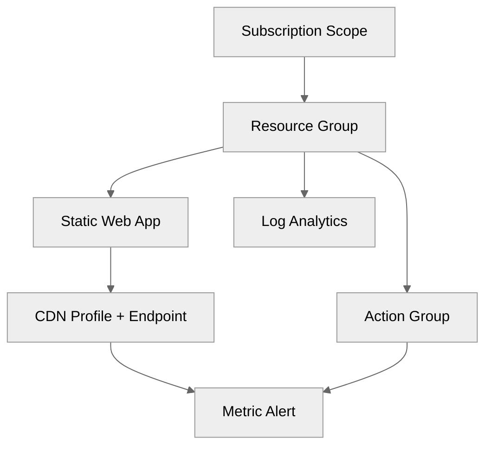

# Step 4: Implementation Plan - e2e-conductor-test

> Generated by bicep-plan agent | 2026-02-05

> [!NOTE]
> 📚 E2E validation test for the 7-step orchestration workflow. Azure Static Web App with CDN deployment.

## Overview

This plan implements a globally distributed static web application using Azure Static Web Apps (Free tier) with Azure CDN for content delivery. The architecture prioritizes **cost optimization** while meeting 99.9% availability requirements.

**Primary Region**: westeurope (required - Static Web Apps regional limitation)  
**Environment**: dev  
**Deployment Target**: Azure Resource Group `rg-e2e-conductor-test-dev-weu`

### Governance Alignment

✅ **Shift-Left Governance Enforcement Applied**

This plan was generated AFTER discovering and analyzing Azure Policy constraints:

- **127 Azure Policies** scanned via Azure Resource Graph
- **9 required tags** identified from tag enforcement policy
- **Policy Definition JSON analyzed** - not just display names
- **0 DEPLOYMENT BLOCKERS** detected

**Governance Constraints File**: See [`04-governance-constraints.md`](04-governance-constraints.md)

---

## Resource Inventory

| Resource                   | Type                                   | SKU/Tier           | AVM Module                              | Region      | Dependencies |
| -------------------------- | -------------------------------------- | ------------------ | --------------------------------------- | ----------- | ------------ |
| Resource Group             | Microsoft.Resources/resourceGroups     | N/A                | `avm/res/resources/resource-group:0.4.3` | westeurope  | (foundation) |
| Static Web App             | Microsoft.Web/staticSites              | Free               | `avm/res/web/static-site:0.9.3`         | westeurope  | Resource Group |
| CDN Profile                | Microsoft.Cdn/profiles                 | Standard_Microsoft | `avm/res/cdn/profile:0.17.1`            | global      | Static Web App |
| Log Analytics Workspace    | Microsoft.OperationalInsights/workspaces | Free tier        | `avm/res/operational-insights/workspace:0.15.0` | westeurope | Resource Group |
| Action Group               | Microsoft.Insights/actionGroups        | N/A                | `avm/res/insights/action-group:0.8.0`   | global      | Resource Group |
| Metric Alert               | Microsoft.Insights/metricAlerts        | N/A                | `avm/res/insights/metric-alert:0.4.1`   | global      | CDN, Action Group |

✅ **All 6 resources have AVM modules available** - Zero raw Bicep resources required

> ⚠️ **Region Limitation**: Static Web Apps are only available in specific regions:  
> westus2, centralus, eastus2, **westeurope**, eastasia  
> Using `westeurope` for EU compliance.

---

## Module Structure

```
infra/bicep/e2e-conductor-test/
├── main.bicep              # Orchestration - subscription scope, deploys all modules
├── main.bicepparam         # Parameters file with default values
├── modules/
│   ├── resource-group.bicep       # Resource Group (AVM)
│   ├── static-web-app.bicep       # Static Web App (AVM)
│   ├── cdn.bicep                  # CDN Profile + Endpoint (AVM)
│   └── monitoring.bicep           # Log Analytics + Action Group + Alert (AVM)
└── deploy.ps1             # Deployment script with what-if analysis
```

---

## Implementation Tasks

### Task 1: main.bicep (Orchestration)

**Purpose**: Main entry point at subscription scope, orchestrates all module deployments

**Target Scope**: `subscription`

**Parameters**:

| Parameter | Type | Default | Description |
|-----------|------|---------|-------------|
| `projectName` | string | `'e2e-conductor-test'` | Project identifier for naming |
| `environment` | string | `'dev'` | Environment (dev/staging/prod) |
| `location` | string | `'westeurope'` | Primary Azure region |
| `owner` | string | - | Owner for tagging (required) |
| `technicalContact` | string | - | Technical contact email (required) |
| `costCenter` | string | `'IT-001'` | Cost center code |

**Variables**:

| Variable | Formula | Purpose |
|----------|---------|---------|
| `uniqueSuffix` | `uniqueString(subscription().subscriptionId, projectName, environment)` | 13-char unique identifier |
| `resourceGroupName` | `'rg-${projectName}-${environment}-weu'` | CAF-compliant RG name |
| `staticWebAppName` | `'stapp-${take(projectName, 10)}-${environment}'` | Static Web App name |
| `cdnProfileName` | `'cdn-${projectName}-${environment}'` | CDN Profile name |
| `cdnEndpointName` | `'cdnep-${take(projectName, 8)}-${take(uniqueSuffix, 8)}'` | Globally unique CDN endpoint |
| `logAnalyticsName` | `'log-${projectName}-${environment}'` | Log Analytics name |
| `actionGroupName` | `'ag-${projectName}-${environment}'` | Action Group name |

**Required Tags** (from governance policy):

```bicep
var requiredTags = {
  environment: environment
  owner: owner
  costcenter: costCenter
  application: projectName
  workload: 'web'
  sla: '99.9%'
  'backup-policy': 'none'
  'maint-window': 'weekends'
  'technical-contact': technicalContact
}
```

**Modules Called**:

1. `modules/resource-group.bicep`
2. `modules/static-web-app.bicep`
3. `modules/cdn.bicep`
4. `modules/monitoring.bicep`

---

### Task 2: modules/resource-group.bicep

**AVM Module**: `br/public:avm/res/resources/resource-group:0.4.3`

**Purpose**: Deploy resource group with all required tags

**Key Configuration**:

```bicep
module resourceGroup 'br/public:avm/res/resources/resource-group:0.4.3' = {
  name: 'deploy-rg-${projectName}'
  params: {
    name: resourceGroupName
    location: location
    tags: requiredTags  // All 9 required tags
  }
}
```

**Outputs**:

- `resourceGroupName`: Name of created resource group
- `resourceGroupId`: Resource ID

---

### Task 3: modules/static-web-app.bicep

**AVM Module**: `br/public:avm/res/web/static-site:0.9.3`

**Purpose**: Deploy Azure Static Web App (Free tier)

**Key Configuration**:

```bicep
module staticWebApp 'br/public:avm/res/web/static-site:0.9.3' = {
  name: 'deploy-stapp'
  scope: resourceGroup(resourceGroupName)
  params: {
    name: staticWebAppName
    location: location
    sku: 'Free'
    stagingEnvironmentPolicy: 'Enabled'
    allowConfigFileUpdates: true
    tags: tags  // Inherited from RG via policy
  }
}
```

**Outputs**:

- `staticWebAppName`: Name of Static Web App
- `defaultHostname`: Default hostname (e.g., `*.azurestaticapps.net`)
- `resourceId`: Resource ID

---

### Task 4: modules/cdn.bicep

**AVM Module**: `br/public:avm/res/cdn/profile:0.17.1`

**Purpose**: Deploy CDN Profile and Endpoint pointing to Static Web App

**Key Configuration**:

```bicep
module cdnProfile 'br/public:avm/res/cdn/profile:0.17.1' = {
  name: 'deploy-cdn'
  scope: resourceGroup(resourceGroupName)
  params: {
    name: cdnProfileName
    location: 'global'
    sku: 'Standard_Microsoft'
    endpoints: [
      {
        name: cdnEndpointName
        originHostHeader: staticWebAppHostname
        origins: [
          {
            name: 'stapp-origin'
            hostName: staticWebAppHostname
            priority: 1
            weight: 1000
            enabled: true
          }
        ]
        isHttpAllowed: false  // HTTPS only
        isHttpsAllowed: true
        queryStringCachingBehavior: 'IgnoreQueryString'
        contentTypesToCompress: [
          'text/html'
          'text/css'
          'application/javascript'
          'application/json'
        ]
        isCompressionEnabled: true
      }
    ]
    tags: tags
  }
}
```

**Outputs**:

- `cdnProfileName`: CDN Profile name
- `cdnEndpointHostname`: CDN endpoint hostname

---

### Task 5: modules/monitoring.bicep

**AVM Modules**:

- `br/public:avm/res/operational-insights/workspace:0.15.0`
- `br/public:avm/res/insights/action-group:0.8.0`
- `br/public:avm/res/insights/metric-alert:0.4.1`

**Purpose**: Deploy monitoring resources (Log Analytics, Action Group, Metric Alert)

**Key Configuration**:

```bicep
// Log Analytics Workspace
module logAnalytics 'br/public:avm/res/operational-insights/workspace:0.15.0' = {
  name: 'deploy-log'
  scope: resourceGroup(resourceGroupName)
  params: {
    name: logAnalyticsName
    location: location
    skuName: 'Free'
    tags: tags
  }
}

// Action Group for alerting
module actionGroup 'br/public:avm/res/insights/action-group:0.8.0' = {
  name: 'deploy-ag'
  scope: resourceGroup(resourceGroupName)
  params: {
    name: actionGroupName
    groupShortName: 'e2e-alerts'
    enabled: true
    emailReceivers: [
      {
        name: 'DevOps Team'
        emailAddress: technicalContact
        useCommonAlertSchema: true
      }
    ]
    tags: tags
  }
}

// CDN Health Alert
module cdnAlert 'br/public:avm/res/insights/metric-alert:0.4.1' = {
  name: 'deploy-alert-cdn'
  scope: resourceGroup(resourceGroupName)
  params: {
    name: 'alert-cdn-health-${projectName}'
    criterias: [
      {
        criterionType: 'StaticThresholdCriterion'
        metricName: 'Percentage4XX'
        metricNamespace: 'Microsoft.Cdn/profiles/endpoints'
        operator: 'GreaterThan'
        threshold: 10
        timeAggregation: 'Average'
      }
    ]
    scopes: [cdnEndpointResourceId]
    actions: [actionGroupId]
    severity: 3
    evaluationFrequency: 'PT5M'
    windowSize: 'PT15M'
    tags: tags
  }
}
```

**Outputs**:

- `logAnalyticsWorkspaceId`: Log Analytics Workspace ID
- `actionGroupId`: Action Group resource ID

---

### Task 6: deploy.ps1 (Deployment Script)

**Purpose**: PowerShell script for deployment with validation

**Features**:

- Parameter validation
- Bicep lint/build verification
- What-If preview before deployment
- Error handling and rollback guidance
- Output display

```powershell
# deploy.ps1
[CmdletBinding()]
param(
    [Parameter(Mandatory=$true)]
    [string]$Owner,
    
    [Parameter(Mandatory=$true)]
    [string]$TechnicalContact,
    
    [string]$Environment = 'dev',
    [string]$Location = 'westeurope',
    [switch]$WhatIf
)

# Validate Bicep
bicep lint main.bicep
if ($LASTEXITCODE -ne 0) { throw "Bicep lint failed" }

bicep build main.bicep
if ($LASTEXITCODE -ne 0) { throw "Bicep build failed" }

# Deploy
$params = @{
    owner = $Owner
    technicalContact = $TechnicalContact
    environment = $Environment
    location = $Location
}

if ($WhatIf) {
    az deployment sub what-if --location $Location --template-file main.bicep --parameters @params
} else {
    az deployment sub create --location $Location --template-file main.bicep --parameters @params --name "e2e-conductor-test-$(Get-Date -Format 'yyyyMMdd-HHmmss')"
}
```

---

## Dependency Graph



---

## Naming Conventions

| Resource             | Pattern                                    | Example                          |
| -------------------- | ------------------------------------------ | -------------------------------- |
| Resource Group       | `rg-{project}-{env}-{region}`              | `rg-e2e-conductor-test-dev-weu`  |
| Static Web App       | `stapp-{project}-{env}`                    | `stapp-e2e-conduc-dev`           |
| CDN Profile          | `cdn-{project}-{env}`                      | `cdn-e2e-conductor-test-dev`     |
| CDN Endpoint         | `cdnep-{project}-{suffix}`                 | `cdnep-e2e-cond-a1b2c3d4`        |
| Log Analytics        | `log-{project}-{env}`                      | `log-e2e-conductor-test-dev`     |
| Action Group         | `ag-{project}-{env}`                       | `ag-e2e-conductor-test-dev`      |

---

## Security Configuration

| Resource          | Security Setting                | Value                |
| ----------------- | ------------------------------- | -------------------- |
| Static Web App    | Staging Environment             | Enabled              |
| Static Web App    | TLS Version                     | 1.2+ (enforced)      |
| CDN Endpoint      | HTTP Allowed                    | `false`              |
| CDN Endpoint      | HTTPS Allowed                   | `true`               |
| CDN Endpoint      | Compression                     | Enabled              |

---

### Cost Estimate

| Resource                | SKU/Tier           | Monthly Cost | Notes                           |
| ----------------------- | ------------------ | ------------ | ------------------------------- |
| Static Web App          | Free               | $0.00        | 100GB bandwidth included        |
| CDN Profile + Endpoint  | Standard_Microsoft | ~$5.00       | Based on 10GB @ $0.07/GB        |
| Log Analytics Workspace | Free tier          | $0.00        | 500MB/day, 7-day retention      |
| Action Group            | N/A                | $0.00        | No charge for action groups     |
| Metric Alert            | N/A                | ~$0.10       | 1 alert rule                    |
| **Total Estimated**     |                    | **~$5.10/mo** | **74% under $20 budget**       |

---

## Estimated Implementation Time

| Task                          | Estimated Duration |
| ----------------------------- | ------------------ |
| Bicep modules (6 resources)   | 30 minutes         |
| Testing (lint, build, what-if)| 15 minutes         |
| Deployment                    | 10 minutes         |
| Validation                    | 10 minutes         |
| **Total**                     | **~65 minutes**    |

---

## Approval Gate

> [!IMPORTANT]
> **📋 Implementation Plan Ready**
>
> **Resources**: 6 Azure resources planned  
> **AVM Coverage**: 100% (6/6 modules)  
> **Governance**: 0 blockers, 9 required tags documented  
> **Cost**: ~$5.10/month (74% under budget)  
> **Region**: westeurope (Static Web App constraint)
>
> Reply **"approve"** to proceed to Bicep Code generation (Step 5)  
> Or provide **feedback** to refine the plan.

---

## References

- [Azure Static Web Apps documentation](https://learn.microsoft.com/en-us/azure/static-web-apps/)
- [Azure CDN documentation](https://learn.microsoft.com/en-us/azure/cdn/)
- [AVM Module Index](https://aka.ms/avm/index)
- [Architecture Assessment](02-architecture-assessment.md)
- [Governance Constraints](04-governance-constraints.md)
