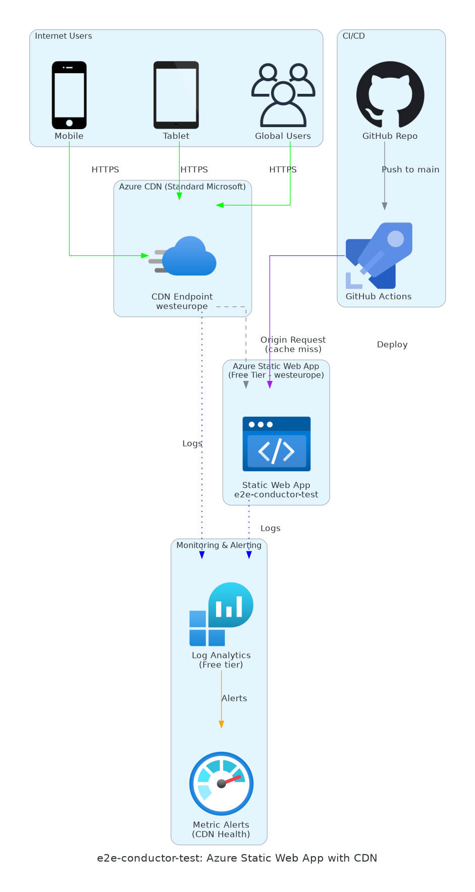

<!-- markdownlint-disable MD033 MD041 -->
<a id="readme-top"></a>

<div align="center">


# 🧪 e2e-conductor-test

**E2E validation of the 7-step orchestration workflow with Azure Static Web App + CDN**

[View Architecture](#-architecture) · [View Artifacts](#-generated-artifacts) · [View Progress](#-workflow-progress)

</div>

---

## 📋 Project Summary

| Property | Value |
|----------|-------|
| **Created** | 2026-02-05 |
| **Last Updated** | 2026-02-05 |
| **Region** | `westeurope` |
| **Environment** | Development |
| **Estimated Cost** | ~$5.10/month |
| **AVM Coverage** | 100% (6/6 modules) |
| **Purpose** | Validate Conductor workflow E2E |

---

## ✅ Workflow Progress

```
[████████░░░░░░░░░░░░] 57% Complete
```

| Step | Phase | Status | Artifact |
|:----:|-------|:------:|----------|
| 1 | Requirements | ✅ | [01-requirements.md](./01-requirements.md) |
| 2 | Architecture | ✅ | [02-architecture-assessment.md](./02-architecture-assessment.md) |
| 3 | Design | ✅ | [03-des-diagram.py](./03-des-diagram.py), [03-des-adr-0001-static-webapp-caching.md](./03-des-adr-0001-static-webapp-caching.md) |
| 4 | Planning | ✅ | [04-implementation-plan.md](./04-implementation-plan.md) |
| 5 | Implementation | ⏳ | *Pending approval* |
| 6 | Deployment | ⏳ | *Awaiting Step 5* |
| 7 | Documentation | ⏳ | *Awaiting Step 6* |

> **Legend**: ✅ Complete | 🔄 In Progress | ⏳ Pending | ⏭️ Skipped

---

## 🏛️ Architecture

<div align="center">



*Generated with [azure-diagrams](../../.github/skills/azure-diagrams/SKILL.md) skill*

</div>

### Key Resources

| Resource | Type | SKU | Purpose |
|----------|------|-----|---------|
| Static Web App | `Microsoft.Web/staticSites` | Free | Host static content |
| CDN Profile | `Microsoft.Cdn/profiles` | Standard_Microsoft | Global content delivery |
| Log Analytics | `Microsoft.OperationalInsights/workspaces` | Free tier | Centralized logging |
| Action Group | `Microsoft.Insights/actionGroups` | N/A | Alert notifications |
| Metric Alert | `Microsoft.Insights/metricAlerts` | N/A | CDN health monitoring |
| Resource Group | `Microsoft.Resources/resourceGroups` | N/A | Deployment scope |

---

## 📄 Generated Artifacts

<details open>
<summary><strong>📁 Step 1-3: Requirements, Architecture & Design</strong></summary>

| File | Description | Created |
|------|-------------|---------|
| [01-requirements.md](./01-requirements.md) | Project requirements with NFRs | 2026-02-05 |
| [02-architecture-assessment.md](./02-architecture-assessment.md) | WAF assessment with pillar scores | 2026-02-05 |
| [03-des-diagram.py](./03-des-diagram.py) | Architecture diagram source | 2026-02-05 |
| [03-des-diagram.png](./03-des-diagram.png) | Architecture diagram image | 2026-02-05 |
| [03-des-adr-0001-static-webapp-caching.md](./03-des-adr-0001-static-webapp-caching.md) | ADR: Caching strategy decision | 2026-02-05 |

</details>

<details open>
<summary><strong>📁 Step 4: Planning & Governance</strong></summary>

| File | Description | Created |
|------|-------------|---------|
| [04-governance-constraints.md](./04-governance-constraints.md) | Azure Policy constraints (127 policies analyzed) | 2026-02-05 |
| [04-governance-constraints.json](./04-governance-constraints.json) | Machine-readable governance data | 2026-02-05 |
| [04-implementation-plan.md](./04-implementation-plan.md) | Bicep implementation plan (6 resources, 100% AVM) | 2026-02-05 |

</details>

<details>
<summary><strong>📁 Step 5-7: Implementation, Deploy & Docs (Pending)</strong></summary>

*These artifacts will be generated as the workflow progresses:*

- `05-implementation-reference.md` - Bicep code link
- `06-deployment-summary.md` - Deployment results
- `07-documentation-index.md` - Workload documentation hub
- `07-design-document.md` - Comprehensive design document
- `07-operations-runbook.md` - Day-2 operational procedures
- `07-resource-inventory.md` - Complete resource inventory
- `07-backup-dr-plan.md` - Backup & DR plan
- `07-ab-cost-estimate.md` - As-built cost estimate

</details>

---

## 💰 Cost Summary

| Resource | Monthly Cost | Notes |
|----------|-------------|-------|
| Static Web App | $0.00 | Free tier |
| CDN | ~$5.00 | Standard tier, usage-based |
| Log Analytics | $0.00 | Free tier (10 GB/month) |
| Monitoring | $0.10 | Alert rules |
| **Total** | **~$5.10** | 74% under $20 budget |

---

## 🔗 Related Resources

| Resource | Path |
|----------|------|
| **Bicep Templates** | [`infra/bicep/e2e-conductor-test/`](../../infra/bicep/e2e-conductor-test/) |
| **Workflow Docs** | [`docs/workflow.md`](../../docs/workflow.md) |
| **Troubleshooting** | [`docs/troubleshooting.md`](../../docs/troubleshooting.md) |

---

## 🚀 Next Steps

1. **Approve Step 4** → Run Bicep Code agent to generate templates
2. **Run validation** → Lint + what-if + code review subagents
3. **Deploy** → Execute deployment in dev environment
4. **Generate docs** → As-built documentation suite

---

<div align="center">

**Generated by [Agentic InfraOps](../../README.md)** · [Report Issue](https://github.com/jonathan-vella/azure-agentic-infraops/issues/new)

<a href="#readme-top">⬆️ Back to Top</a>

</div>
