<!-- _class: lead -->
<!-- _backgroundColor: #0078D4 -->
<!-- _color: white -->

# Agentic InfraOps

## Azure infrastructure engineered by agents

**Verified. Well-Architected. Deployable.**

🔗 **aka.ms/agenticinfraops**

---

# What is Agentic InfraOps?


**AI-powered infrastructure development** using coordinated GitHub Copilot agents

| Benefit                 | Description                                        |
| ----------------------- | -------------------------------------------------- |
| 🤖 **AI-Orchestrated**  | Specialized agents per phase—no context overload   |
| 🏛️ **Well-Architected** | Built-in Azure WAF & Verified Modules alignment    |
| 📋 **Traceable**        | Every decision documented: requirements → deployed |
| 🔄 **Repeatable**       | Same workflow for any Azure workload               |

---

# The 7-Step Agentic Workflow

```mermaid
%%{init: {'theme':'neutral'}}%%
flowchart LR
    REQ["🎯 Requirements"] --> S1["1️⃣ Project<br/>Planner"]
    S1 --> S2["2️⃣ Azure<br/>Architect"]
    S2 --> S3["3️⃣ Design<br/>Artifacts"]
    S3 --> S4["4️⃣ Bicep<br/>Plan"]
    S4 --> S5["5️⃣ Bicep<br/>Implement"]
    S5 --> S6["6️⃣ Deploy"]
    S6 --> S7["7️⃣ Docs"]
    S7 --> OUT["✅ Production"]
```



| Step | Agent                              | Output                          |
| ---- | ---------------------------------- | ------------------------------- |
| 1    | `Project Planning`                 | `01-requirements.md`            |
| 2    | `Azure Architecture`               | `02-architecture-assessment.md` |
| 3    | `Archiecture Diagrams & Decisions` | `03-des-*` diagrams, ADRs       |
| 4    | `Infra-as-Code Planning`           | `04-implementation-plan.md`     |
| 5    | `Bicep code generation`            | `infra/bicep/*` templates       |
| 6    | `Deployment`                       | `06-deployment-summary.md`      |
| 7    | `Documentation`                    | `07-*` runbooks, inventory      |

---

# Live Demo: Agent Workflow


_30-second animated demo showing the complete 7-step workflow_

---

# Key Agents (8 Custom Agents)

| Agent                              | Step | Purpose                                         |
| ---------------------------------- | ---- | ----------------------------------------------- |
| `project-planner`                  | 1    | Gather NFRs, constraints, business context      |
| `azure-principal-architect`        | 2    | WAF assessment, service selection (**NO CODE**) |
| `diagram-generator`                | 3, 7 | Create architecture diagrams (Python Diagrams)  |
| `adr-generator`                    | 3, 7 | Document architectural decisions (ADRs)         |
| `bicep-plan`                       | 4    | Governance discovery, AVM module selection      |
| `bicep-implement`                  | 5    | Generate AVM-compliant Bicep code               |
| `deploy`                           | 6    | Execute deployments, what-if analysis           |
| `workload-documentation-generator` | 7    | Create runbooks, inventory, DR plans            |

---


# Well-Architected Alignment

Every design is scored against Azure WAF pillars

**Agents ensure compliance with:**

- ✅ Azure Security Benchmark
- ✅ Reliability best practices
- ✅ Performance targets
- ✅ Cost constraints
- ✅ Operational excellence

> Architecture assessment before any code is written

---

# 💰 Azure Pricing MCP

**Real-time pricing** integrated into architecture phase

| Tool                     | Purpose                   |
| ------------------------ | ------------------------- |
| `azure_price_search`     | Query retail prices       |
| `azure_region_recommend` | Find cost-optimal regions |
| `azure_cost_estimate`    | Calculate monthly costs   |
| `azure_sku_discovery`    | List available SKUs       |

> Accurate cost estimates before you write any code

---


# ROI: The Business Case

**$19/user/month** investment

| Metric     | Value        |
| ---------- | ------------ |
| Break-even | Week 1       |
| Annual ROI | **39:1**     |
| Time saved | 8 hours/week |

> **416 hours saved** per IT Pro annually

---

# Time Savings by Task


| Task            | Before | After | Savings  |
| --------------- | ------ | ----- | -------- |
| IaC Development | 6.0h   | 1.5h  | **-75%** |
| Documentation   | 4.0h   | 0.5h  | **-88%** |
| Troubleshooting | 3.0h   | 1.0h  | **-67%** |
| Code Review     | 2.0h   | 0.5h  | **-75%** |

---

# Before vs After


---

# Getting Started

## 1. Clone & Open

```bash
git clone https://github.com/jonathan-vella/azure-agentic-infraops
code azure-agentic-infraops
# F1 → "Dev Containers: Reopen in Container"
```

## 2. Start the Workflow

1. Press `Ctrl+Alt+I` to open Copilot Chat
2. Select agent from picker (e.g., `project-planner`)
3. Describe your requirements
4. Wait for approval before next step

---

# Example Prompts

**E-Commerce Platform:**

```text
Create a PCI-DSS compliant e-commerce platform with
Azure Front Door, App Service, and SQL Database
```

**Healthcare Portal:**

```text
Create a HIPAA-compliant patient portal with
secure access to medical records
```

**Data Analytics:**

```text
Create a data analytics platform with
Azure Synapse and Power BI integration
```

---

# Security & Trust

| Concern        | Answer                               |
| -------------- | ------------------------------------ |
| Code retention | ❌ No code retained after response   |
| Training       | ❌ Not trained on your code          |
| Compliance     | ✅ SOC 2 Type II compliant           |
| Approval       | ✅ Human approval at every step      |
| Quality        | ✅ WAF + AVM + Bicep lint validation |

> "Trust but verify" - every agent step requires your approval

---

# Executive Summary


---

<!-- _class: lead -->
<!-- _backgroundColor: #0078D4 -->
<!-- _color: white -->

# Thank You!

## Start your Agentic InfraOps journey today

🔗 **aka.ms/agenticinfraops**

**Questions?** Open a GitHub Discussion
