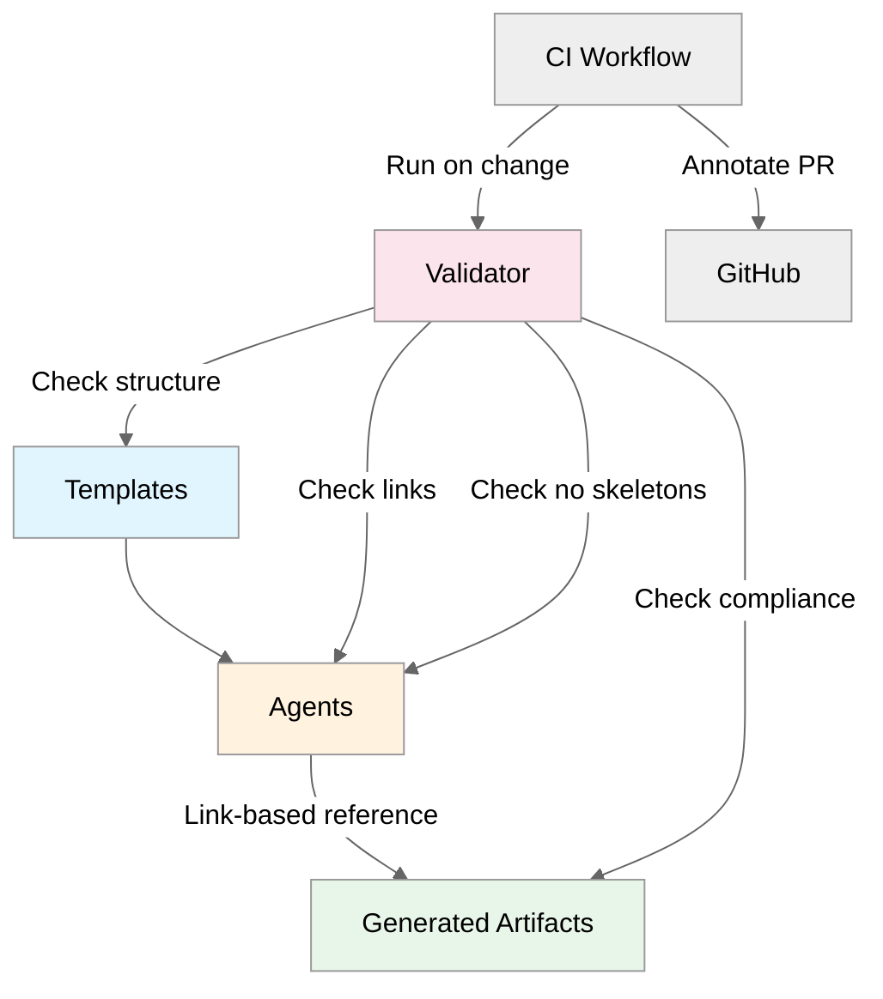

# Wave 1 Artifact Templatization

**Status**: ✅ Implemented (Strictness: `relaxed`)  
**Ratchet Target**: `standard` (after 2 conforming regenerations)

## Overview

Wave 1 standardizes the four core workflow artifacts (01, 02, 04, 06) using canonical templates
stored in `.github/templates/`. Agents now reference these templates instead of embedding
structure inline, preventing template drift and ensuring consistency across regenerations.

## Artifacts Covered

| Step | Artifact                | Template                                 | Agent                     |
| ---- | ----------------------- | ---------------------------------------- | ------------------------- |
| 1    | Requirements            | `01-requirements.template.md`            | @plan (built-in)          |
| 2    | Architecture Assessment | `02-architecture-assessment.template.md` | azure-principal-architect |
| 4    | Implementation Plan     | `04-implementation-plan.template.md`     | bicep-plan                |
| 6    | Deployment Summary      | `06-deployment-summary.template.md`      | Deployment/manual         |

## Template Contract

Each template defines:

1. **Invariant H2 sections**: Required headings in exact order
2. **Anchor section**: Last required H2 (marks where optionals may begin)
3. **Optional sections**: Allow-list of sections permitted after anchor
4. **Content guidance**: Brief instructions/examples under each section

### Example: 01-requirements.md

**Invariant sections** (must appear in this order):

```markdown
## Project Overview

## Functional Requirements

## Non-Functional Requirements (NFRs)

## Compliance & Security Requirements

## Cost Constraints

## Operational Requirements

## Regional Preferences
```

**Anchor**: `## Regional Preferences` (last required)

**Optionals**: `## Summary for Architecture Assessment` (may appear after anchor)

## Validation System

### Script

`scripts/validate-wave1-artifacts.mjs`

**What it checks:**

1. Templates exist and have correct invariant H2 structure
2. Agents link to templates (no embedded skeletons)
3. Agents do not embed skeleton structure in fenced blocks
4. Standards documentation references template-first approach
5. Actual artifacts in `agent-output/` conform to template structure

### Strictness Modes

| Mode       | Missing Invariants | Out-of-Order Invariants | Optionals Before Anchor | Unrecognized H2s |
| ---------- | ------------------ | ----------------------- | ----------------------- | ---------------- |
| `relaxed`  | Warn               | Fail                    | Warn                    | Allow            |
| `standard` | Fail               | Fail                    | Warn                    | Warn             |

**Current**: `relaxed` (set in CI workflow via `STRICTNESS` env var)

**Ratchet plan**: Promote to `standard` after:

- 2 conforming scenario regenerations documented
- No drift warnings in CI for 1 sprint

### CI Workflow

`.github/workflows/wave1-artifact-drift-guard.yml`

**Triggers**: PR/push changes to:

- Templates (`01-requirements.template.md`, etc.)
- Producing agents (`azure-principal-architect.agent.md`, `bicep-plan.agent.md`)
- Standards (`markdown.instructions.md`)
- Validator script (`validate-wave1-artifacts.mjs`)

**Behavior**:

- Runs validator in current strictness mode
- Annotates PR with warnings/errors via GitHub Actions annotations
- Fails build on hard failures (strictness-dependent)

### npm Script

```bash
npm run lint:wave1-artifacts
```

Runs validator locally (uses `STRICTNESS` env var or defaults to `relaxed`).

## Agent Integration

### azure-principal-architect

**Updated sections:**

- Added reference to `01-requirements.template.md` for Step 1 capture
- Added reference to `02-architecture-assessment.template.md`
- Removed embedded file structure skeleton

**Handoff requirement:**

- Must reference template when generating `02-architecture-assessment.md`
- Must follow invariant H2 order exactly

### bicep-plan

**Updated sections:**

- Added reference to `04-implementation-plan.template.md`
- Removed embedded YAML resource skeleton
- Simplified output structure documentation

**Handoff requirement:**

- Must reference template when generating `04-implementation-plan.md`
- Must follow invariant H2 order exactly

### @plan (built-in)

**Reference added:**

- `01-requirements.template.md` linked in instructions
- No enforcement mechanism (built-in agent)

**Future consideration:**

- Add prompt guard or copilot-instructions enforcement
- For now, rely on regeneration feedback loop

## Drift Prevention Architecture



## Files Changed

### Created

- `.github/templates/01-requirements.template.md`
- `.github/templates/02-architecture-assessment.template.md`
- `.github/templates/04-implementation-plan.template.md`
- `.github/templates/06-deployment-summary.template.md`
- `.github/templates/README.md`
- `scripts/validate-wave1-artifacts.mjs`
- `.github/workflows/wave1-artifact-drift-guard.yml`
- `docs/reference/wave1-templatization.md` (this file)

### Modified

- `.github/agents/azure-principal-architect.agent.md`
  - Added template references for 01, 02
  - Removed embedded file structure
- `.github/agents/bicep-plan.agent.md`
  - Added template reference for 04
  - Removed embedded YAML skeleton
- `.github/instructions/markdown.instructions.md`
  - Added "Template-First Approach" section
  - Documented Wave 1 requirements
- `package.json`
  - Added `lint:wave1-artifacts` script

## Testing & Golden Examples

### Validation Status

**static-webapp-test** (Golden example):

- ✅ `01-requirements.md` - Conforms to template
- ✅ `02-architecture-assessment.md` - Conforms to template
- ✅ `04-implementation-plan.md` - Conforms to template
- ✅ `06-deployment-summary.md` - Conforms to template

**ecommerce** (Pre-template example):

- ⚠️ `04-implementation-plan.md` - Missing invariant sections (expected - generated before templates)

### Regeneration Plan

To prove template stability:

1. Regenerate one scenario end-to-end (e.g., `S03-agentic-workflow`)
2. Validate all Wave 1 artifacts conform (no warnings)
3. Regenerate second scenario (e.g., new scenario or `S04-ecommerce-platform`)
4. Validate conformance
5. Ratchet to `standard` strictness
6. Update `wave1-artifact-drift-guard.yml` to use `STRICTNESS=standard`

## Rollout Timeline

| Phase       | Action                               | Success Criteria                              |
| ----------- | ------------------------------------ | --------------------------------------------- |
| **Phase 1** | Templates + validator implemented    | ✅ CI passes, golden example validates        |
| **Phase 2** | Regenerate Scenario 1                | All Wave 1 artifacts conform (no warnings)    |
| **Phase 3** | Regenerate Scenario 2                | All Wave 1 artifacts conform (no warnings)    |
| **Phase 4** | Ratchet to `standard`                | CI updated, no new warnings for 1 sprint      |
| **Phase 5** | Wave 2 planning (03, ADRs, diagrams) | Design contract surfaces for Step 3 artifacts |

**Current Phase**: Phase 1 (✅ Complete)  
**Next Milestone**: Phase 2 (Regenerate S03 or create new scenario)

## Future Work

### Wave 2: Step 3 Artifacts

- `03-des-diagram.py` (Python diagrams code)
- `03-adr-*.md` (Architecture Decision Records)
- Potentially `03-des-cost-estimate.md` (already has template, move to Wave 1?)

### Wave 3: Step 7 Artifacts

- `07-ab-diagram.py` (As-built diagram)
- `07-backup-dr-plan.md`
- `07-compliance-matrix.md`
- `07-design-document.md`
- `07-operations-runbook.md`
- `07-resource-inventory.md`

### Wave 4: Governance & Testing

- `04-governance-constraints.md` (already exists, standardize structure)
- Test plan templates
- Deployment script templates

## Maintenance

### When to Update Templates

Templates are **intentionally minimal skeletons**. Update only when:

1. Invariant H2 structure needs to change (major)
2. Optional sections need formalization (minor)
3. Content guidance needs clarification (patch)

**Versioning**: Consider semantic versioning if templates become complex (e.g., `v1.0.0`).

### When to Update Validator

Update `validate-wave1-artifacts.mjs` when:

1. New invariant sections added/removed
2. Optional section allow-list changes
3. Strictness semantics evolve
4. New validation rules needed (e.g., check for specific keywords)

### When to Ratchet Strictness

Promote `relaxed` → `standard` when:

1. ≥2 conforming regenerations documented
2. No drift warnings in CI for 1 sprint (2 weeks)
3. Team consensus on enforcement

**Warning**: Ratcheting may cause temporary CI failures if existing artifacts are non-conforming.
Plan regeneration cleanup before ratcheting.

## References

- **Templates**: `.github/templates/`
- **Validator**: `scripts/validate-wave1-artifacts.mjs`
- **CI Workflow**: `.github/workflows/wave1-artifact-drift-guard.yml`
- **Agent Definitions**: `.github/agents/azure-principal-architect.agent.md`, `bicep-plan.agent.md`
- **Standards**: `.github/instructions/markdown.instructions.md`
- **Implementation Plan**: `untitled:plan-templatizeArtifacts.prompt.md` (original spec)

---

_Wave 1 templatization ensures artifact consistency across agent generations,
preventing structure drift and enabling reliable automation._
