# Workflow Reference

> **Version 3.6.0** | Canonical 7-step agent workflow diagram

This document contains the authoritative workflow diagram for Agentic InfraOps. All other documentation should
link to this document rather than duplicating the diagram.

---

## The 7-Step Workflow

```mermaid
%%{init: {'theme':'neutral'}}%%
graph TB
    subgraph "Step 1: Requirements"
        P["@plan<br/>(built-in)"]
    end

    subgraph "Step 2: Architecture"
        A["azure-principal-architect<br/>(NO CODE)"]
        MCP["💰 Azure Pricing MCP"]
    end

    subgraph "Step 3: Design Artifacts"
        D["📊 diagram-generator<br/>(-des suffix)"]
        ADR1["📝 adr-generator<br/>(-des suffix)"]
    end

    subgraph "Step 4: Planning"
        B["bicep-plan<br/>(governance discovery)"]
    end

    subgraph "Step 5: Implementation"
        I["bicep-implement<br/>(code generation)"]
    end

    subgraph "Step 6: Deploy"
        DEP["🚀 Deploy to Azure<br/>(PowerShell/CLI)"]
    end

    subgraph "Step 7: As-Built Artifacts"
        D2["📊 diagram-generator<br/>(-ab suffix)"]
        ADR2["📝 adr-generator<br/>(-ab suffix)"]
        WL["📚 workload-documentation"]
    end

    P -->|"requirements"| A
    MCP -.->|"pricing data"| A
    A -->|"architecture"| D
    A -->|"architecture"| ADR1
    D --> B
    ADR1 --> B
    A -->|"skip artifacts"| B
    B -->|"plan"| I
    I -->|"code complete"| DEP
    DEP -->|"deployed"| D2
    DEP -->|"deployed"| ADR2
    DEP -->|"deployed"| WL

    style P fill:#e1f5fe
    style A fill:#fff3e0
    style MCP fill:#fff9c4
    style D fill:#f3e5f5
    style ADR1 fill:#e8eaf6
    style B fill:#e8f5e9
    style I fill:#fce4ec
    style DEP fill:#c8e6c9
    style D2 fill:#f3e5f5
    style ADR2 fill:#e8eaf6
    style WL fill:#e3f2fd
```



---

## Workflow Summary Table

| Step | Agent/Phase                 | Purpose                              | Output Files                    | Required |
| ---- | --------------------------- | ------------------------------------ | ------------------------------- | -------- |
| 1    | `@plan` (built-in)          | Gather requirements                  | `01-requirements.md`            | ✅ Yes   |
| 2    | `azure-principal-architect` | WAF assessment (NO CODE)             | `02-architecture-assessment.md` | ✅ Yes   |
| 3    | Design Artifacts            | Diagrams, cost estimates, ADRs       | `03-des-*`                      | Optional |
| 4    | `bicep-plan`                | Implementation planning + governance | `04-*`                          | ✅ Yes   |
| 5    | `bicep-implement`           | Bicep code generation                | `infra/bicep/{project}/`        | ✅ Yes   |
| 6    | Deploy                      | Deploy to Azure                      | `06-deployment-summary.md`      | ✅ Yes   |
| 7    | As-Built Artifacts          | Final documentation                  | `07-*`                          | Optional |

---

## Simplified Linear View

```mermaid
%%{init: {'theme':'neutral'}}%%
graph LR
    P["@plan<br/>Step 1"] --> A[azure-principal-architect<br/>Step 2]
    A --> D["Design Artifacts<br/>Step 3"]
    D --> B[bicep-plan<br/>Step 4]
    B --> I[bicep-implement<br/>Step 5]
    I --> DEP["Deploy<br/>Step 6"]
    DEP --> F["As-Built Artifacts<br/>Step 7"]
    MCP["💰 Azure Pricing MCP"] -.->|real-time costs| A
    MCP -.->|cost validation| B
```



---

## Quick Workflow (Skip Optional Steps)

For rapid deployment, skip Steps 3 and 7:

```text
Step 1: @plan → Requirements
Step 2: azure-principal-architect → WAF Assessment
Step 4: bicep-plan → Implementation Plan
Step 5: bicep-implement → Bicep Code
Step 6: Deploy → Azure Deployment
```

---

## Step Details

### Step 1: Requirements (@plan)

**Agent**: `@plan` (VS Code built-in)

**📋 Template**: [`.github/prompts/plan-requirements.prompt.md`](../../.github/prompts/plan-requirements.prompt.md)

**Key Information to Capture**:

| Category              | Examples                                                 |
| --------------------- | -------------------------------------------------------- |
| Project Overview      | Name, type, timeline, stakeholders                       |
| Functional Reqs       | Core capabilities, user types, integrations              |
| Non-Functional (NFRs) | SLA (99.9%/99.95%/99.99%), RTO, RPO, performance targets |
| Compliance & Security | HIPAA, PCI-DSS, GDPR, SOC 2, data residency              |
| Cost Constraints      | Monthly/annual budget, optimization priorities           |

---

### Step 2: Architecture (azure-principal-architect)

**Agent**: `azure-principal-architect`

**Key Behaviors**:

- Validates requirements include NFRs before proceeding
- Scores each WAF pillar (Reliability, Security, Cost, Operations, Performance)
- Recommends Azure services and patterns
- Integrates with Azure Pricing MCP for cost estimates
- **Does NOT create any code**

---

### Step 3: Design Artifacts (Optional)

| Tool/Agent             | Purpose                         | Output Suffix |
| ---------------------- | ------------------------------- | ------------- |
| 📊 `diagram-generator` | Visualize proposed architecture | `-des`        |
| 📝 `adr-generator`     | Document design decisions       | `-des`        |
| 💰 Cost Estimate       | Azure pricing analysis          | `-des`        |

---

### Step 4: Planning (bicep-plan)

**Agent**: `bicep-plan`

**Key Behaviors**:

- Queries Azure Resource Graph for policy assignments
- Generates governance constraints file
- Creates implementation plan with module structure
- Integrates with Azure Pricing MCP for cost validation

---

### Step 5: Implementation (bicep-implement)

**Agent**: `bicep-implement`

**Key Behaviors**:

- Generates `main.bicep` + module files
- Creates deployment script (`deploy.ps1`)
- Validates with `bicep build` and `bicep lint`
- Follows unique suffix pattern for resource names
- Uses Azure Verified Modules where available

---

### Step 6: Deploy

**Manual step** using generated scripts:

```bash
# Preview changes
./deploy.ps1 -WhatIf

# Deploy
./deploy.ps1
```

---

### Step 7: As-Built Artifacts (Optional)

| Tool/Agent                        | Purpose                       | Output Suffix |
| --------------------------------- | ----------------------------- | ------------- |
| 📊 `diagram-generator`            | Document deployed state       | `-ab`         |
| 📝 `adr-generator`                | Document implementation notes | `-ab`         |
| 📚 `workload-documentation-gen.`  | Customer-deliverable docs     | `07-*`        |

---

## Output Organization

All agent outputs go to `agent-output/{project-name}/`:

```text
agent-output/{project}/
├── README.md                      # Project index
├── 01-requirements.md             # Step 1
├── 02-architecture-assessment.md  # Step 2
├── 03-des-diagram.py + .png       # Step 3 (optional)
├── 03-des-cost-estimate.md        # Step 3 (optional)
├── 03-des-adr-NNN-*.md            # Step 3 (optional)
├── 04-implementation-plan.md      # Step 4
├── 04-governance-constraints.md   # Step 4
├── 05-implementation-reference.md # Step 5
├── 06-deployment-summary.md       # Step 6
├── 07-ab-diagram.py + .png        # Step 7 (optional)
├── 07-ab-adr-NNN-*.md             # Step 7 (optional)
└── 07-*.md                        # Step 7 workload docs
```

Bicep code goes to `infra/bicep/{project-name}/`.

---

## Azure Pricing MCP Integration

The Azure Pricing MCP server provides real-time pricing data:

**Used in Steps 2 and 4** automatically via MCP tools:

- `azure_price_search` — Search Azure retail prices
- `azure_region_recommend` — Compare regional pricing
- `azure_cost_estimate` — Generate cost estimates
- `azure_sku_discovery` — Find available SKUs

**Fallback Chain**:

1. Azure Pricing MCP (first choice)
2. `fetch_webpage` for Azure pricing pages
3. Azure Retail API via `curl`
4. Azure Pricing Calculator (manual)

---

## Related Documentation

- [Agents Overview](agents-overview.md) — All 7 agents
- [Defaults Reference](defaults.md) — Regions, naming, tags
- [Bicep Patterns](bicep-patterns.md) — Code patterns
- [Full Workflow Guide](../workflow/WORKFLOW.md) — Detailed documentation
