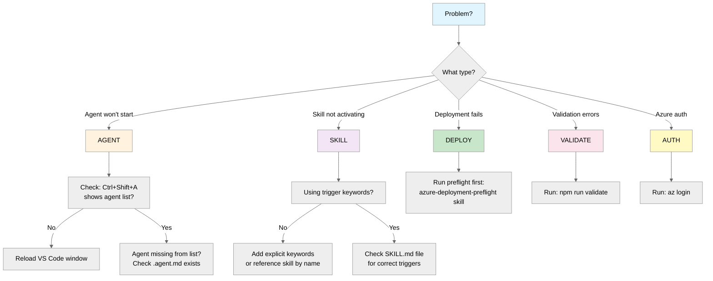

# Troubleshooting Guide

> Common issues and solutions for Agentic InfraOps

## Quick Decision Tree



---

## Common Issues

### 1. Agent Not Appearing in List

**Symptom**: `Ctrl+Shift+A` doesn't show expected agent.

**Causes**:

- Agent file not in `.github/agents/` folder
- YAML front matter syntax error
- VS Code extension not loaded

**Solutions**:

```bash
# Check agent files exist
ls -la .github/agents/*.agent.md

# Validate YAML front matter
head -20 .github/agents/requirements.agent.md
```

Reload VS Code: `Ctrl+Shift+P` → "Developer: Reload Window"

---

### 2. Skill Not Activating Automatically

**Symptom**: Prompt doesn't trigger expected skill.

**Causes**:

- Missing trigger keywords in prompt
- Skill file not in `.github/skills/` folder
- Description doesn't match user intent

**Solutions**:

Use explicit skill invocation:

```text
"Use the azure-diagrams skill to create a diagram"
```

Check skill triggers in `SKILL.md`:

```bash
cat .github/skills/azure-diagrams/SKILL.md | head -30
```

---

### 3. Deployment Fails with Azure Policy Error

**Symptom**: `az deployment group create` fails with policy violation.

**Common policies**:

| Error | Cause | Solution |
|-------|-------|----------|
| "Azure AD only" | SQL Server needs AAD auth | Set `azureADOnlyAuthentication: true` |
| "Zone redundancy" | Wrong SKU tier | Use P1v4+ for App Service |
| "Missing tags" | Required tags absent | Add Environment, ManagedBy, Project, Owner |

**Run preflight check**:

```text
"Run deployment preflight for {project}"
```

---

### 4. Bicep Build Errors

**Symptom**: `bicep build` fails.

**Common causes**:

```bash
# Check Bicep CLI version
bicep --version  # Should be 0.30+

# Validate syntax
bicep lint infra/bicep/{project}/main.bicep
```

**AVM module not found**:

```bash
# Restore modules from registry
bicep restore infra/bicep/{project}/main.bicep
```

---

### 5. Azure Authentication Issues

**Symptom**: "Not logged in" or subscription errors.

**Solutions**:

```bash
# Login to Azure
az login

# Set correct subscription
az account set --subscription "<subscription-id>"

# Verify
az account show
```

For Service Principal:

```bash
az login --service-principal -u $AZURE_CLIENT_ID -p $AZURE_CLIENT_SECRET --tenant $AZURE_TENANT_ID
```

---

### 6. Artifact Validation Failures

**Symptom**: `npm run validate` fails.

**Causes**:

- Missing required H2 headings
- Headings in wrong order
- Using prohibited references

**Check specific artifact**:

```bash
# See validation rules
cat scripts/validate-artifact-templates.mjs | grep -A20 "ARTIFACT_HEADINGS"
```

**Fix order issues**: Compare with template:

```bash
diff -u .github/templates/01-requirements.template.md agent-output/{project}/01-requirements.md
```

---

### 7. MCP Server Not Responding

**Symptom**: Azure Pricing MCP calls fail.

**Solutions**:

```bash
# Check MCP configuration
cat .vscode/mcp.json

# Verify Python environment
python3 --version  # Should be 3.10+

# Install dependencies
cd mcp/azure-pricing-mcp && pip install -r requirements.txt
```

---

### 8. Devcontainer Build Fails

**Symptom**: Dev container won't start.

**Common causes**:

- Docker not running
- Port conflicts
- Outdated base image

**Solutions**:

```bash
# Rebuild without cache
# In VS Code: Ctrl+Shift+P → "Dev Containers: Rebuild Container Without Cache"
```

Check Docker is running:

```bash
docker ps
```

---

### 9. Git Push Fails with Lefthook Errors

**Symptom**: Pre-commit hooks fail.

**Common hooks**:

| Hook | Command | Fix |
|------|---------|-----|
| Artifact validation | `npm run validate` | Fix H2 structure |
| Markdown lint | `npm run lint:md` | Fix markdown issues |
| Commitlint | `commitlint` | Use conventional commit format |

**Skip hooks temporarily** (not recommended):

```bash
git commit --no-verify -m "fix: temporary"
```

---

### 10. Handoff Prompt Not Working

**Symptom**: Agent handoff button does nothing.

**Causes**:

- Handoff target agent doesn't exist
- YAML handoffs section malformed

**Check handoffs syntax**:

```yaml
handoffs:
  - label: "Create WAF Assessment"
    agent: architect
    prompt: "Assess requirements for WAF..."
    send: true
```

Ensure target agent exists:

```bash
ls .github/agents/architect.agent.md
```

---

## Diagnostic Commands

### Environment Check

```bash
# All-in-one status
echo "=== Bicep ===" && bicep --version
echo "=== Azure CLI ===" && az version --output table
echo "=== Node ===" && node --version
echo "=== Python ===" && python3 --version
echo "=== Git ===" && git --version
```

### Workspace Validation

```bash
# Validate all artifacts
npm run validate

# Check for broken links
npm run check-links

# Lint markdown
npm run lint:md
```

### Azure Status

```bash
# Current subscription
az account show --output table

# List resource groups
az group list --output table

# Check deployments
az deployment group list -g {resource-group} --output table
```

---

## Getting Help

1. **Check scenarios**: `scenarios/` folder has working examples
2. **Read agent definitions**: `.github/agents/*.agent.md`
3. **Check skill files**: `.github/skills/*/SKILL.md`
4. **Review templates**: `.github/templates/`

### Still Stuck?

Use the `diagnose` agent:

```text
Ctrl+Shift+A → diagnose
"My bicep-code agent isn't generating valid templates"
```
