# Agent and Skill Workflow

> Version 8.0.0 | The 7-step infrastructure development workflow

## Overview

Agentic InfraOps uses agents and skills to transform requirements into deployed Azure infrastructure.

```mermaid
%%{init: {'theme':'neutral'}}%%
graph TB
    subgraph "Step 1: Requirements"
        REQ["requirements<br/>📋 Agent"]
    end

    subgraph "Step 2: Architecture"
        ARCH["architect<br/>🏛️ Agent"]
        MCP["💰 Azure Pricing MCP"]
    end

    subgraph "Step 3: Design Artifacts"
        DIAG["azure-diagrams<br/>📊 Skill"]
        ADR["azure-adr<br/>📝 Skill"]
    end

    subgraph "Step 4: Planning"
        PLAN["bicep-plan<br/>📐 Agent"]
    end

    subgraph "Step 5: Implementation"
        CODE["bicep-code<br/>⚙️ Agent"]
    end

    subgraph "Step 6: Deployment"
        DEP["deploy<br/>🚀 Agent"]
    end

    subgraph "Step 7: Documentation"
        DOCS["azure-workload-docs<br/>📚 Skill"]
        DIAG2["azure-diagrams<br/>📊 Skill"]
    end

    REQ -->|"01-requirements.md"| ARCH
    MCP -.->|"pricing data"| ARCH
    ARCH -->|"02-assessment.md"| DIAG
    ARCH --> ADR
    DIAG --> PLAN
    ADR --> PLAN
    ARCH -->|"skip artifacts"| PLAN
    PLAN -->|"04-plan.md"| CODE
    CODE -->|"infra/bicep/"| DEP
    DEP -->|"06-summary.md"| DOCS
    DEP --> DIAG2

    style REQ fill:#e1f5fe
    style ARCH fill:#fff3e0
    style MCP fill:#fff9c4
    style DIAG fill:#f3e5f5
    style ADR fill:#e8eaf6
    style PLAN fill:#e8f5e9
    style CODE fill:#fce4ec
    style DEP fill:#c8e6c9
    style DOCS fill:#e3f2fd
    style DIAG2 fill:#f3e5f5
```



---

## Workflow Steps

| Step | Agent/Skill                          | Purpose             | Output                          |
| ---- | ------------------------------------ | ------------------- | ------------------------------- |
| 1    | `requirements` agent                 | Gather requirements | `01-requirements.md`            |
| 2    | `architect` agent                    | WAF assessment      | `02-architecture-assessment.md` |
| 3    | `azure-diagrams`, `azure-adr` skills | Design artifacts    | `03-des-*.md/.py`               |
| 4    | `bicep-plan` agent                   | Implementation plan | `04-implementation-plan.md`     |
| 5    | `bicep-code` agent                   | Bicep templates     | `infra/bicep/{project}/`        |
| 6    | `deploy` agent                       | Azure deployment    | `06-deployment-summary.md`      |
| 7    | `azure-workload-docs` skill          | Documentation       | `07-*.md`                       |

---

## Step Details

### Step 1: Requirements

**Agent**: `requirements`

Gather infrastructure requirements through interactive conversation.

```text
Invoke: Ctrl+Shift+A → requirements
Output: agent-output/{project}/01-requirements.md
```

**Handoff**: Automatically suggests `architect` agent.

---

### Step 2: Architecture

**Agent**: `architect`

Evaluate requirements against Azure Well-Architected Framework pillars.

```text
Invoke: Ctrl+Shift+A → architect
Output: agent-output/{project}/02-architecture-assessment.md
```

**Features**:

- WAF pillar scoring (Reliability, Security, Cost, Operations, Performance)
- SKU recommendations
- Cost estimation via Azure Pricing MCP

**Handoff**: Suggests `azure-diagrams` skill or `bicep-plan` agent.

---

### Step 3: Design Artifacts (Optional)

**Skills**: `azure-diagrams`, `azure-adr`

Create visual and textual design documentation.

```text
Trigger: "Create an architecture diagram for {project}"
Output: agent-output/{project}/03-des-diagram.py, 03-des-adr-*.md
```

**Diagram types**: Azure architecture, business flows, ERD, timelines

**ADR content**: Decision, context, alternatives, consequences

---

### Step 4: Planning

**Agent**: `bicep-plan`

Create detailed implementation plan with governance discovery.

```text
Invoke: Ctrl+Shift+A → bicep-plan
Output: agent-output/{project}/04-implementation-plan.md, 04-governance-constraints.md
```

**Features**:

- Azure Policy compliance check
- AVM module selection
- Resource dependency mapping
- Naming convention validation

---

### Step 5: Implementation

**Agent**: `bicep-code`

Generate Bicep templates following Azure Verified Modules standards.

```text
Invoke: Ctrl+Shift+A → bicep-code
Output: infra/bicep/{project}/main.bicep, modules/
```

**Standards**:

- AVM-first approach
- Unique suffix for global names
- Required tags on all resources
- Security defaults (TLS 1.2, HTTPS-only)

---

### Step 6: Deployment

**Agent**: `deploy`

Execute Azure deployment with preflight validation.

```text
Invoke: Ctrl+Shift+A → deploy
Output: agent-output/{project}/06-deployment-summary.md
```

**Features**:

- Bicep build validation
- What-if analysis before deploy
- Deployment execution
- Post-deployment verification

---

### Step 7: Documentation

**Skill**: `azure-workload-docs`

Generate comprehensive workload documentation.

```text
Trigger: "Generate documentation for {project}"
Output: agent-output/{project}/07-*.md (7 files)
```

**Documents**:

| File                        | Purpose                |
| --------------------------- | ---------------------- |
| `07-documentation-index.md` | Master index           |
| `07-design-document.md`     | 10-section design doc  |
| `07-operations-runbook.md`  | Day-2 procedures       |
| `07-resource-inventory.md`  | Resource listing       |
| `07-ab-cost-estimate.md`    | As-built cost analysis |
| `07-compliance-matrix.md`   | Security controls      |
| `07-backup-dr-plan.md`      | DR procedures          |

---

## Agents vs Skills

| Aspect          | Agents                  | Skills                |
| --------------- | ----------------------- | --------------------- |
| **Invocation**  | Manual (`Ctrl+Shift+A`) | Automatic or explicit |
| **Interaction** | Conversational          | Task-focused          |
| **State**       | Session context         | Stateless             |
| **Output**      | Multiple artifacts      | Specific outputs      |
| **When to use** | Core workflow steps     | Specialized tasks     |

### Invoking Skills

**Automatic**: Skills activate based on prompt keywords.

```text
"Create an architecture diagram" → azure-diagrams skill activates
```

**Explicit**: Reference the skill by name.

```text
"Use the azure-adr skill to document the database decision"
```

**Via Agent Handoff**: Agents invoke skills internally.

```text
architect agent → "Generate Architecture Diagram" handoff → azure-diagrams skill
```

---

## Artifact Naming

| Step           | Prefix    | Example                                     |
| -------------- | --------- | ------------------------------------------- |
| Requirements   | `01-`     | `01-requirements.md`                        |
| Architecture   | `02-`     | `02-architecture-assessment.md`             |
| Design         | `03-des-` | `03-des-diagram.py`, `03-des-adr-0001-*.md` |
| Planning       | `04-`     | `04-implementation-plan.md`                 |
| Implementation | `05-`     | `05-implementation-reference.md`            |
| Deployment     | `06-`     | `06-deployment-summary.md`                  |
| As-Built       | `07-`     | `07-design-document.md`, `07-ab-diagram.py` |
| Diagnostics    | `08-`     | `08-resource-health-report.md`              |

---

## Quick Reference

### Start a New Project

```text
1. Ctrl+Shift+A → requirements
2. Describe your infrastructure needs
3. Follow handoffs through the workflow
```

### Skip Optional Steps

Design artifacts (Step 3) are optional. After `architect`, you can go directly to `bicep-plan`.

### Generate Documentation Later

Use the `azure-workload-docs` skill anytime after deployment:

```text
"Generate workload documentation for {project}"
```
