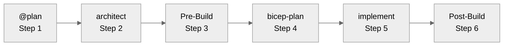

# Workflow Documentation

This folder contains the complete guide to the Agentic InfraOps six-step agentic workflow.

## Quick Reference

| Step | Agent/Phase                 | Purpose                                      |
| ---- | --------------------------- | -------------------------------------------- |
| 1    | `@plan`                     | Generate implementation plan                 |
| 2    | `azure-principal-architect` | WAF assessment, architecture guidance        |
| 3    | Pre-Build Artifacts         | Design diagrams + ADRs (`-design` suffix)    |
| 4    | `bicep-plan`                | AVM module selection, governance discovery   |
| 5    | `bicep-implement`           | Generate validated Bicep templates           |
| 6    | Post-Build Artifacts        | As-built diagrams + ADRs (`-asbuilt` suffix) |

> **Note**: Steps 3 and 6 are optional artifact phases using `diagram-generator` and `adr-generator`.

## Main Documentation

➡️ **[WORKFLOW.md](WORKFLOW.md)** — Complete guide with detailed instructions for each step

This comprehensive guide covers:

- How to invoke and use each agent
- Approval gates and when to proceed
- Best practices for effective prompting
- Common patterns and anti-patterns
- Troubleshooting workflow issues

## Related Documentation

- [Quick Start](../guides/quickstart.md) — 10-minute setup + first workflow run
- [Getting Started Journey](../guides/getting-started-journey.md) — Comprehensive onboarding with learning paths
- [Troubleshooting](../guides/troubleshooting.md) — Common issues and solutions
- [Agent Definitions](../../.github/agents/) — Customize agent behavior
