# Agentic InfraOps - Agent Workflow

> **Version 3.2.0** | Last Updated: December 7, 2025

This document describes the 6-step agent workflow for Azure infrastructure development with Agentic InfraOps.

---

## Overview

```mermaid
%%{init: {'theme':'neutral'}}%%
graph TB
    subgraph "Step 1: Requirements"
        P["@plan<br/>(built-in)"]
    end

    subgraph "Step 2: Architecture"
        A["azure-principal-architect<br/>(NO CODE)"]
        MCP["💰 Azure Pricing MCP"]
    end

    subgraph "Step 3: Pre-Build Artifacts"
        D["📊 diagram-generator<br/>(-design suffix)"]
        ADR1["📝 adr-generator<br/>(-design suffix)"]
    end

    subgraph "Step 4: Planning"
        B["bicep-plan<br/>(governance discovery)"]
    end

    subgraph "Step 5: Implementation"
        I["bicep-implement<br/>(code generation)"]
    end

    subgraph "Step 6: Post-Build Artifacts"
        D2["📊 diagram-generator<br/>(-asbuilt suffix)"]
        ADR2["📝 adr-generator<br/>(-asbuilt suffix)"]
    end

    P -->|"requirements"| A
    MCP -.->|"pricing data"| A
    A -->|"architecture"| D
    A -->|"architecture"| ADR1
    D --> B
    ADR1 --> B
    A -->|"skip artifacts"| B
    B -->|"plan"| I
    I -->|"code complete"| D2
    I -->|"code complete"| ADR2

    style P fill:#e1f5fe
    style A fill:#fff3e0
    style MCP fill:#fff9c4
    style D fill:#f3e5f5
    style ADR1 fill:#e8eaf6
    style B fill:#e8f5e9
    style I fill:#fce4ec
    style D2 fill:#f3e5f5
    style ADR2 fill:#e8eaf6
```



## Workflow Steps

| Step | Agent/Phase                 | Purpose                              | Creates                             | Required |
| ---- | --------------------------- | ------------------------------------ | ----------------------------------- | -------- |
| 1    | `@plan` (built-in)          | Gather requirements                  | Requirements plan                   | ✅ Yes   |
| 2    | `azure-principal-architect` | WAF assessment & pricing             | Architecture recommendations        | ✅ Yes   |
| 3    | Pre-Build Artifacts         | Visualize design, document decisions | `-design` diagrams + ADRs           | Optional |
| 4    | `bicep-plan`                | Implementation planning + governance | `INFRA.md` + governance constraints | ✅ Yes   |
| 5    | `bicep-implement`           | Code generation                      | Bicep templates                     | ✅ Yes   |
| 6    | Post-Build Artifacts        | Document final state                 | `-asbuilt` diagrams + ADRs          | Optional |

### Step 3: Pre-Build Artifacts (Optional)

| Tool/Agent             | Purpose                         | Output Suffix | Triggered By                        |
| ---------------------- | ------------------------------- | ------------- | ----------------------------------- |
| 📊 `diagram-generator` | Visualize proposed architecture | `-design`     | Ask: "generate diagram"             |
| 📝 `adr-generator`     | Document design decisions       | `-design`     | Ask: "create ADR for this decision" |

### Step 4: Governance Discovery (NEW)

The `bicep-plan` agent now discovers Azure Policy constraints before creating the plan:

1. Queries Azure Resource Graph for policy assignments
2. Generates `.bicep-planning-files/governance-constraints.md` and `.json`
3. Ensures implementation plan complies with org policies

### Step 6: Post-Build Artifacts (Optional)

| Tool/Agent             | Purpose                           | Output Suffix | Triggered By                         |
| ---------------------- | --------------------------------- | ------------- | ------------------------------------ |
| 📊 `diagram-generator` | Document deployed architecture    | `-asbuilt`    | Ask: "generate as-built diagram"     |
| 📝 `adr-generator`     | Document implementation decisions | `-asbuilt`    | Ask: "create ADR for implementation" |

---

## 💰 Azure Pricing MCP Integration

The Azure Pricing MCP Server provides **real-time cost data** to agents during infrastructure planning.
This eliminates guesswork and ensures accurate cost estimates.

### Available Tools

| Tool                     | Purpose                                | Used By               |
| ------------------------ | -------------------------------------- | --------------------- |
| `azure_price_search`     | Query Azure retail prices with filters | architect, bicep-plan |
| `azure_price_compare`    | Compare prices across regions/SKUs     | architect             |
| `azure_cost_estimate`    | Calculate monthly/yearly costs         | architect, bicep-plan |
| `azure_region_recommend` | Find cheapest Azure regions for a SKU  | architect             |
| `azure_discover_skus`    | List available SKUs for a service      | architect, bicep-plan |
| `azure_sku_discovery`    | Fuzzy SKU name matching                | architect             |

### How It Works


### Setup

The MCP server is **automatically configured** when you open the Dev Container. Manual setup:

```bash
cd mcp/azure-pricing-mcp
python -m venv .venv
source .venv/bin/activate  # Windows: .venv\Scripts\activate
pip install -r requirements.txt
```

### Configuration

Pre-configured in `.vscode/mcp.json`:

```json
{
  "servers": {
    "azure-pricing": {
      "type": "stdio",
      "command": "${workspaceFolder}/mcp/azure-pricing-mcp/.venv/bin/python",
      "args": ["-m", "azure_pricing_mcp"],
      "cwd": "${workspaceFolder}/mcp/azure-pricing-mcp/src"
    }
  }
}
```

### Creating Cost Documentation

During the architecture phase, ask:

- **"save costs"** - Creates `docs/{project}-cost-estimate.md`
- **"save"** - Creates `docs/{project}-waf-assessment.md`

### Fallback

If MCP tools are unavailable, agents will recommend [Azure Pricing Calculator](https://azure.microsoft.com/pricing/calculator/).

---

## How to Use

### Starting the Workflow

1. Open GitHub Copilot Chat (`Ctrl+Alt+I`)
2. Click the **Agent** button or press `Ctrl+Shift+A`
3. Select `@plan` to start with requirements
4. Follow the agent handoffs through each step

### Approval Gates

Each step requires your explicit approval before proceeding:

| Response                   | Action                             |
| -------------------------- | ---------------------------------- |
| **"yes"** or **"approve"** | Continue to next step              |
| **Feedback text**          | Agent refines output               |
| **"no"**                   | Return to previous step or restart |

### Example Conversation Flow

```
You: @plan Create a HIPAA-compliant patient portal with Azure App Service and SQL Database

Plan Agent: [Generates requirements plan]
           Do you approve this plan?

You: yes

[Handoff to azure-principal-architect]

Architect: [Provides WAF assessment with scores]
           [Queries Azure Pricing MCP for real-time costs]

           💰 Cost Breakdown (via MCP):
           ┌─────────────────────────┬──────────────┐
           │ Resource                │ Monthly Cost │
           ├─────────────────────────┼──────────────┤
           │ App Service P1v4 (x2)   │ $412         │
           │ Azure SQL S3            │ $150         │
           │ Key Vault Standard      │ $3           │
           │ Log Analytics (5GB/day) │ $50          │
           └─────────────────────────┴──────────────┘
           Total: ~$615/month

           Do you approve? Want a diagram first?

You: yes generate the diagram

Architect: [Invokes diagram-generator]
           ✅ Created docs/diagrams/patient-portal/architecture.py
           ✅ Generated architecture.png

           Ready to continue to Bicep planning?

You: approve

[Handoff to bicep-plan]

Planner: [Creates implementation plan in .bicep-planning-files/]
         [Validates costs with Azure Pricing MCP]
         Do you approve this implementation plan?

You: yes

[Handoff to bicep-implement]

Implementer: [Generates Bicep templates]
             Validation: bicep build ✅ | bicep lint ✅
             Do you approve this implementation?

You: deploy

Implementer: [Executes deployment to Azure]
```

---

## Agent Responsibilities

### @plan (Built-in VS Code Feature)

- **Input**: Natural language requirements
- **Output**: Structured requirements plan
- **Limitations**: Cannot access workspace files

### azure-principal-architect

- **Input**: Requirements from @plan or user
- **Output**: WAF pillar assessment, SKU recommendations, cost estimates
- **Integrations**:
  - 💰 Uses Azure Pricing MCP for real-time costs
  - 📊 Can invoke diagram-generator for visualizations
  - 📝 Can invoke adr-generator for decisions
- **Limitations**: ❌ Cannot create or edit Bicep/Terraform code files
- **Documentation**: Can create `docs/{project}-waf-assessment.md` and `docs/{project}-cost-estimate.md`

### diagram-generator

- **Input**: Architecture context from azure-principal-architect OR bicep-implement
- **Output**: Python diagram file in `docs/diagrams/{goal}/` + PNG image
- **Artifact Suffix**:
  - `-design` when called from Step 2 (architecture phase)
  - `-asbuilt` when called from Step 5 (implementation phase)
- **Triggered By**: User request ("generate diagram", "create as-built diagram")
- **Library**: Uses Python `diagrams` library

### bicep-plan

- **Input**: Architecture assessment from azure-principal-architect
- **Output**:
  - Implementation plan in `.bicep-planning-files/INFRA.{goal}.md`
  - Governance constraints in `.bicep-planning-files/governance-constraints.md` and `.json`
- **Governance Discovery**: Queries Azure Policy via MCP before planning
- **Integrations**: 💰 Uses Azure Pricing MCP for SKU cost validation
- **Limitations**: ❌ Cannot create actual Bicep code
- **Focus**: Detailed planning with AVM modules + policy compliance

### bicep-implement

- **Input**: Implementation plan from `.bicep-planning-files/`
- **Output**: Bicep templates in `infra/bicep/{goal}/`
- **Limitations**: Must follow the approved plan
- **Validation**: Runs `bicep build` and `bicep lint`
- **Focus**: Code generation and deployment
- **Handoffs**: Can invoke diagram-generator and adr-generator for post-build artifacts

### adr-generator (Optional)

- **Input**: Any architectural decision during the workflow
- **Output**: ADR in `docs/adr/`
- **Artifact Suffix**:
  - `-design` when documenting design decisions (Step 3)
  - `-asbuilt` when documenting implementation decisions (Step 6)
- **When to Use**: Major technology choices, trade-off decisions, policy exceptions

---

## Alternative: Unified Agent

For simple infrastructure or quick iterations, use `infrastructure-specialist` which combines all steps
into a single agent. This is useful for:

- Small projects (< 5 resources)
- Prototyping and experimentation
- Users familiar with Azure who don't need step-by-step guidance

---

## File Locations

| Artifact               | Location                                            |
| ---------------------- | --------------------------------------------------- |
| Implementation plans   | `.bicep-planning-files/INFRA.{goal}.md`             |
| Governance constraints | `.bicep-planning-files/governance-constraints.md`   |
| Governance JSON        | `.bicep-planning-files/governance-constraints.json` |
| Bicep templates        | `infra/bicep/{goal}/`                               |
| Architecture diagrams  | `docs/diagrams/{goal}/`                             |
| MCP diagrams           | `docs/diagrams/mcp/`                                |
| Cost estimates         | `docs/{project}-cost-estimate.md`                   |
| WAF assessments        | `docs/{project}-waf-assessment.md`                  |
| ADRs                   | `docs/adr/`                                         |
| Agent definitions      | `.github/agents/`                                   |
| MCP server             | `mcp/azure-pricing-mcp/`                            |
| MCP configuration      | `.vscode/mcp.json`                                  |

---

## Troubleshooting

### Agent Not Available

1. Press `Ctrl+Shift+A` to open agent picker
2. Verify agent files exist in `.github/agents/`
3. Restart VS Code if agents don't appear

### MCP Pricing Not Working

1. Check MCP server status: Command Palette → "MCP: List Servers"
2. Verify `azure-pricing` shows 6 tools
3. If not, run setup: `cd mcp/azure-pricing-mcp && pip install -r requirements.txt`
4. Restart VS Code

### Handoff Not Working

1. Look for the handoff button in chat response
2. If no button, manually switch agents with `Ctrl+Shift+A`
3. Copy relevant context to new agent conversation

### Validation Failures

| Error                 | Solution                            |
| --------------------- | ----------------------------------- |
| `bicep build` fails   | Check syntax errors in Bicep files  |
| `bicep lint` warnings | Address best practice violations    |
| Deployment fails      | Verify Azure permissions and quotas |

---

## Related Documentation

- [Time Savings Evidence](../value-proposition/time-savings-evidence.md) — Quantified efficiency gains (45 min vs 18+ hours)
- [Copilot Portfolio Showcase](../value-proposition/copilot-portfolio-showcase.md) — Real-world projects
- [ADR-003: AVM-First Approach](../adr/ADR-003-avm-first-approach.md) — Why we use Azure Verified Modules
- [ADR-004: Region Defaults](../adr/ADR-004-region-defaults.md) — Default `swedencentral`, fallback guidance
- [Scenario Prompts](../../scenarios/S11-quick-demos/ecommerce-prompts.md)
- [Copilot Instructions](../../.github/copilot-instructions.md)
- [Azure Pricing MCP README](../../mcp/azure-pricing-mcp/README.md)
- [README](../../README.md)
