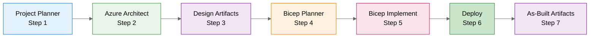
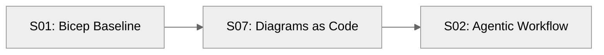
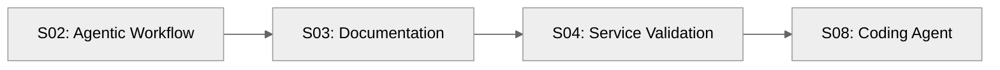

# Scenarios Overview

> **Version 4.0.0** | [Changelog](../VERSION.md)
>
> **Hands-on learning scenarios demonstrating Agentic InfraOps as an efficiency multiplier
> for IT Professionals.**

---

## Defaults & Workflow

> **Region**: `swedencentral` (fallback: `germanywestcentral`).
> See [ADR-004](../docs/adr/ADR-004-region-defaults.md).
>
> **Modules**: AVM-first for policy-compliant deployments.
> See [ADR-003](../docs/adr/ADR-003-avm-first-approach.md).
>
> **Agent Workflow**: `Project Planner` → `azure-principal-architect` → `bicep-plan` → `bicep-implement`.
> See [Workflow Guide](../docs/reference/workflow.md).

---

## Quick Start

| If you're...                     | Start with                                    |
| -------------------------------- | --------------------------------------------- |
| **New to Copilot**               | [S01 Bicep Baseline](#s01-bicep-baseline)     |
| **Experienced with IaC**         | [S02 Agentic Workflow](#s02-agentic-workflow) |
| **Looking for async automation** | [S08 Coding Agent](#s08-coding-agent)         |

---

## Scenario Index

| #   | Scenario                                                  | Character       | Challenge                              | Time      | Difficulty      |
| --- | --------------------------------------------------------- | --------------- | -------------------------------------- | --------- | --------------- |
| S01 | [Bicep Baseline](#s01-bicep-baseline)                     | Elena Rodriguez | Build secure Azure network foundation  | 30 min    | 🟢 Beginner     |
| S02 | [Agentic Workflow](#s02-agentic-workflow)                 | Jennifer Chen   | End-to-end infrastructure design       | 45-60 min | 🔴 Advanced     |
| S03 | [Documentation Generation](#s03-documentation-generation) | Priya Sharma    | Auto-generate docs from code           | 90 min    | 🟡 Intermediate |
| S04 | [Service Validation](#s04-service-validation)             | Marcus Chen     | Automated UAT and load testing         | 30 min    | 🟡 Intermediate |
| S05 | [Troubleshooting](#s05-troubleshooting)                   | Maya Patel      | Diagnose infrastructure issues         | 25 min    | 🟡 Intermediate |
| S06 | [SBOM Generator](#s06-sbom-generator)                     | Sarah Chen      | Software Bill of Materials             | 75 min    | 🟡 Intermediate |
| S07 | [Diagrams as Code](#s07-diagrams-as-code)                 | David Kim       | Python-generated architecture diagrams | 20 min    | 🟢 Beginner     |
| S08 | [Coding Agent](#s08-coding-agent)                         | Alex Petrov     | Async implementation via GitHub Issues | 30 min    | 🔴 Advanced     |

**Difficulty Legend:**

- 🟢 **Beginner** — No prior Azure/IaC experience required. Good first scenarios.
- 🟡 **Intermediate** — Familiarity with Azure basics and IaC concepts expected.
- 🔴 **Advanced** — Multi-step workflows, compliance requirements, production-grade patterns.

---

## Scenario Details

### S01: Bicep Baseline

**[📁 View Scenario](S01-bicep-baseline/)**

> **Character**: Elena Rodriguez — Cloud Infrastructure Engineer with 10 years VMware experience,
> first Azure project

**Challenge**: Build a secure hub-spoke network foundation in 2 weeks with security requirements
she's still learning.

**What You'll Learn**:

- Bicep fundamentals and Azure resource model
- Virtual Network concepts (mapped from VMware knowledge)
- Network Security Groups for microsegmentation
- Storage account security and private endpoints
- Module organization and parameter files

**Key Insight**: Copilot as a **learning partner** that maps existing skills to new platforms.

---

### S02: Agentic Workflow

**[📁 View Scenario](S02-agentic-workflow/)**

> **Character**: Jennifer Chen — Solutions Architect at Meridian Systems (SI Partner)

> **Production Example**: [`infra/bicep/contoso-patient-portal/`](../infra/bicep/contoso-patient-portal/) —
> 1,070 lines of Bicep, 10 modules

**Challenge**: Design and implement a HIPAA-compliant patient portal for Contoso Healthcare.

**The 7-Step Agentic Workflow**:

| Step | Agent/Phase                 | Type     | Purpose                                   |
| ---- | --------------------------- | -------- | ----------------------------------------- |
| 1    | `Project Planner`           | Custom   | Requirements gathering → `01-*`           |
| 2    | `azure-principal-architect` | Custom   | Azure WAF assessment → `02-*`             |
| 3    | Design Artifacts            | Optional | Design diagrams + ADRs (`-des`) → `03-*`  |
| 4    | `bicep-plan`                | Custom   | Infrastructure planning → `04-*`          |
| 5    | `bicep-implement`           | Custom   | Generate production-ready Bicep → `05-*`  |
| 6    | Deploy                      | Manual   | Deploy to Azure → `06-*`                  |
| 7    | As-Built Artifacts          | Optional | As-built diagrams + ADRs (`-ab`) → `07-*` |

**Time Comparison**:

| Approach              | Duration       |
| --------------------- | -------------- |
| Traditional manual    | 18+ hours      |
| With Agentic Workflow | **45 minutes** |

**Key Insight**: Structured agent handoffs preserve context and produce near-production-ready code.

---

### S03: Documentation Generation

**[📁 View Scenario](S03-documentation-generation/)**

> **Character**: Priya Sharma — Cloud Solutions Architect at a Microsoft Partner

**Challenge**: Generate comprehensive documentation for existing Azure infrastructure to satisfy
compliance and knowledge transfer requirements.

**What You'll Learn**:

- Auto-generate design documents from Azure resources
- Create operations runbooks from infrastructure code
- Produce resource inventories from Bicep templates
- Generate compliance matrices for audits

**Key Insight**: Documentation as a **byproduct** of infrastructure development, not an afterthought.

---

### S04: Service Validation

**[📁 View Scenario](S04-service-validation/)**

> **Character**: Marcus Chen — Platform Engineer at HealthTech Systems

**Challenge**: Implement automated User Acceptance Testing (UAT) and load testing for a healthcare
application before production go-live.

**What You'll Learn**:

- AI-assisted test planning and execution
- Load testing with k6 and Azure Load Testing
- Functional testing with Playwright
- Test result interpretation and sign-off

**Key Insight**: Copilot as a **QA partner** that helps design and execute comprehensive test suites.

---

### S05: Troubleshooting

**[📁 View Scenario](S05-troubleshooting/)**

> **Character**: Maya Patel — Cloud Operations Engineer

**Challenge**: Diagnose and resolve infrastructure issues during an on-call incident.

**What You'll Learn**:

- Diagnostic conversation patterns with Copilot
- Azure resource health investigation
- Log analysis and correlation
- Root cause analysis workflows

**Key Insight**: Copilot as a **diagnostic partner** that accelerates incident resolution.

---

### S06: SBOM Generator

**[📁 View Scenario](S06-sbom-generator/)**

> **Character**: Sarah Chen — Security Engineer at HealthTech Solutions

**Challenge**: Create a Software Bill of Materials (SBOM) for a healthcare application to satisfy
security and compliance requirements.

**What You'll Learn**:

- SBOM generation for Azure deployments
- Dependency analysis and vulnerability scanning
- Component inventory documentation
- Supply chain security practices

**Key Insight**: SBOMs as a **security baseline** for Azure infrastructure deployments.

---

### S07: Diagrams as Code

**[📁 View Scenario](S07-diagrams-as-code/)**

> **Character**: David Kim — Solutions Architect at TechVentures Ltd

**Challenge**: Create version-controlled, reproducible architecture diagrams using Python.

**What You'll Learn**:

- Python `diagrams` library for Azure architecture
- Diagram-as-code patterns and best practices
- Integration with the 7-step agent workflow
- Regenerating diagrams as infrastructure evolves

**Key Insight**: Diagrams that **evolve with code**, not separate presentation artifacts.

---

### S08: Coding Agent

**[📁 View Scenario](S08-coding-agent/)**

> **Character**: Alex Petrov — Cloud Operations Engineer at Contoso Healthcare

**Challenge**: Implement monitoring and alerting before production go-live, using async automation
via GitHub Issues.

**What You'll Learn**:

- GitHub Copilot coding agent for infrastructure tasks
- Async implementation via GitHub Issues
- Issue-to-PR automation workflows
- Agent collaboration patterns

**Key Insight**: Offload implementation to an **async agent** while focusing on higher-value work.

---

## Learning Paths

### For Beginners (2-3 hours)

### For Experienced Practitioners (4-6 hours)

---

## Time Savings Evidence

| Scenario               | Traditional | Agentic | Savings |
| ---------------------- | ----------- | ------- | ------- |
| S01 Bicep Baseline     | 4 hours     | 30 min  | 88%     |
| S02 Agentic Workflow   | 18+ hours   | 45 min  | 96%     |
| S03 Documentation      | 8 hours     | 90 min  | 81%     |
| S04 Service Validation | 6 hours     | 30 min  | 92%     |
| S07 Diagrams as Code   | 45 min      | 20 min  | 56%     |
| S08 Coding Agent       | 8+ hours    | 30 min  | 94%     |

---

## Related Resources

- [Workflow Guide](../docs/reference/workflow.md)
- [Agents Overview](../docs/reference/agents-overview.md)
- [Bicep Patterns](../docs/reference/bicep-patterns.md)
- [Getting Started](../docs/getting-started/quickstart.md)

---

_Scenarios updated for Agentic InfraOps v3.11.0_
