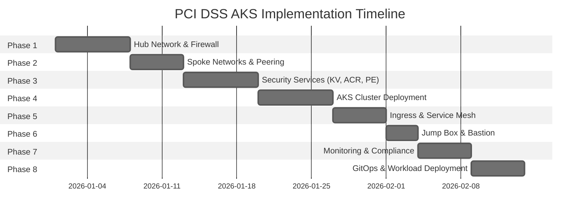

# Step 1: Plan Agent (@plan)

> **Agent Used:** `@plan` (built-in VS Code Copilot agent)  
> **Purpose:** Create initial deployment plan with requirements and cost estimates

---

## 💬 Prompt

```text
Create a deployment plan for a PCI DSS 4.0.1 compliant AKS cluster on Azure using a hub-spoke network topology
with Azure Firewall for egress control, Application Gateway with WAF for ingress, private cluster configuration,
and jump box access via Azure Bastion (aligned with Microsoft's regulated AKS baseline architecture).

Business Requirements:
- PCI DSS 4.0.1 compliance for cardholder data environment (CDE)
- Host payment processing microservices in a regulated Kubernetes environment
- Zero trust network architecture with strict segmentation
- Private cluster with no public API server exposure
- Secure operational access via jump box and Azure Bastion
- 99.95% SLA for production workloads

Technical Requirements (based on Microsoft reference architecture):

Hub Network Components:
- Azure Firewall for egress traffic control and IDPS
- Azure Bastion for secure jump box access
- Hub VNet with dedicated subnets for firewall, bastion, and gateway

Spoke Network 1 - AKS Cluster (CDE):
- Private AKS cluster with Azure CNI networking
- Three node pools: system, in-scope (PCI workloads), out-of-scope (non-PCI workloads)
- Each node pool in dedicated subnet for network isolation
- Azure Application Gateway with WAF v2 for ingress
- Nginx ingress controller inside the cluster
- mTLS between pods using Open Service Mesh or similar
- Azure Container Registry with private endpoint
- Azure Key Vault with Private Link for secrets, certificates, and encryption keys
- Log Analytics workspace with 90-day retention

Spoke Network 2 - Image Builder:
- Azure Image Builder for secure VM images
- Virtual Machine Scale Sets for jump box instances
- Pre-installed management tools (Azure CLI, kubectl, Flux CLI)

Security & Compliance Requirements:
- NSGs on all subnets with deny-by-default rules
- Kubernetes NetworkPolicies for pod-to-pod zero trust
- TLS 1.2+ everywhere, mTLS for internal cluster traffic
- Azure Policy with PCI-DSS initiative and Gatekeeper policies
- Microsoft Defender for Containers enabled
- Host-based encryption for node VMs
- Customer-managed keys (BYOK) for disk encryption
- DDoS Protection for public-facing endpoints
- Azure AD integration with Conditional Access and JIT access

Operational Requirements:
- GitOps deployment model (Flux or ArgoCD)
- No direct kubectl access from build agents
- All cluster access through governed jump box
- Container image signing and verification
- Azure Monitor and Microsoft Sentinel integration

Constraints:
- Region: swedencentral (primary), germanywestcentral (DR)
- Team has Kubernetes experience
- Must pass PCI DSS 4.0.1 audit
- Budget: Enterprise-grade (compliance over cost optimization)

Please provide a detailed implementation plan including:
1. Recommended Azure services for each component
2. Hub-spoke network architecture with IP addressing
3. AKS cluster configuration and node pool design
4. Security controls mapped to PCI DSS requirements
5. Estimated monthly costs
6. Implementation phases
```

---

## ✅ Output

# PCI DSS 4.0.1 Compliant AKS Cluster on Azure

Deploy a PCI DSS 4.0.1 compliant Azure Kubernetes Service cluster using a hub-spoke network topology.
The architecture implements zero trust networking, private cluster access, Azure Firewall for egress control,
Application Gateway with WAF for ingress, and comprehensive security controls aligned with the
Microsoft reference architecture for regulated workloads.

---

## Business Requirements

| Requirement          | Target                                 |
| -------------------- | -------------------------------------- |
| Compliance           | PCI DSS 4.0.1                          |
| Workload             | Payment processing microservices (CDE) |
| Network Model        | Zero Trust with strict segmentation    |
| Cluster Exposure     | Private (no public API server)         |
| Availability         | 99.95% SLA                             |
| Operational Access   | Jump box via Azure Bastion only        |

---

## Recommended Azure Services

| Component                    | Service                               | SKU/Tier        | Rationale                                           |
| ---------------------------- | ------------------------------------- | --------------- | --------------------------------------------------- |
| Hub Firewall                 | Azure Firewall                        | Premium         | IDPS, TLS inspection, egress filtering for PCI      |
| Secure Access                | Azure Bastion                         | Standard        | RDP/SSH to jump box without public IPs              |
| Jump Box                     | Virtual Machine Scale Sets            | Standard_D4s_v5 | Governed access point for kubectl operations        |
| Image Build                  | Azure Image Builder                   | —               | Secure, repeatable VM image creation                |
| Ingress Gateway              | Azure Application Gateway             | WAF_v2          | Layer 7 LB with WAF for PCI Requirement 6.6         |
| Kubernetes                   | Azure Kubernetes Service              | Private cluster | CDE hosting, private API server                     |
| Container Registry           | Azure Container Registry              | Premium         | Geo-replication, private endpoint, image signing    |
| Secrets & Certificates       | Azure Key Vault                       | Premium         | HSM-backed, Private Link, certificate management    |
| Service Mesh                 | Open Service Mesh / Istio             | —               | mTLS for pod-to-pod encryption                      |
| Egress Control               | Azure Firewall + UDR                  | Premium         | All egress through firewall, FQDN filtering         |
| Monitoring                   | Azure Monitor + Log Analytics         | Pay-as-you-go   | 90-day retention, Defender for Containers           |
| SIEM                         | Microsoft Sentinel                    | Pay-as-you-go   | Security event correlation, compliance reporting    |
| DDoS Protection              | Azure DDoS Network Protection         | Standard        | Protect public IPs (Application Gateway)            |
| Policy & Governance          | Azure Policy + Gatekeeper             | —               | PCI DSS policy initiative, admission control        |

---

## Hub-Spoke Network Architecture

```text
┌─────────────────────────────────────────────────────────────────────────────────┐
│                              HUB VNET (10.0.0.0/16)                             │
│  ┌─────────────────────┐  ┌─────────────────────┐  ┌─────────────────────────┐  │
│  │ AzureFirewallSubnet │  │ AzureBastionSubnet  │  │  GatewaySubnet          │  │
│  │   10.0.0.0/26       │  │   10.0.1.0/26       │  │   10.0.2.0/27           │  │
│  │   Azure Firewall    │  │   Azure Bastion     │  │   (VPN/ExpressRoute)    │  │
│  └─────────────────────┘  └─────────────────────┘  └─────────────────────────┘  │
└─────────────────────────────────────────────────────────────────────────────────┘
                                        │
                         VNet Peering (Hub-Spoke)
                                        │
    ┌───────────────────────────────────┴───────────────────────────────────┐
    │                                                                       │
    ▼                                                                       ▼
┌───────────────────────────────────────────┐   ┌───────────────────────────────────┐
│      SPOKE 1: AKS CLUSTER (10.1.0.0/16)   │   │   SPOKE 2: IMAGE BUILD (10.2.0.0/16)│
│  ┌─────────────────────────────────────┐  │   │  ┌─────────────────────────────┐  │
│  │ snet-aks-system    (10.1.0.0/24)    │  │   │  │ snet-imagebuilder (10.2.0.0/24)│ │
│  │ System node pool                    │  │   │  │ Azure Image Builder agents   │  │
│  └─────────────────────────────────────┘  │   │  └─────────────────────────────┘  │
│  ┌─────────────────────────────────────┐  │   │  ┌─────────────────────────────┐  │
│  │ snet-aks-inscope   (10.1.1.0/24)    │  │   │  │ snet-jumpbox    (10.2.1.0/24)│  │
│  │ In-scope PCI node pool              │  │   │  │ Jump box VMSS               │  │
│  └─────────────────────────────────────┘  │   │  └─────────────────────────────┘  │
│  ┌─────────────────────────────────────┐  │   └───────────────────────────────────┘
│  │ snet-aks-outofscope (10.1.2.0/24)   │  │
│  │ Out-of-scope node pool              │  │
│  └─────────────────────────────────────┘  │
│  ┌─────────────────────────────────────┐  │
│  │ snet-appgw         (10.1.3.0/24)    │  │
│  │ Application Gateway + WAF           │  │
│  └─────────────────────────────────────┘  │
│  ┌─────────────────────────────────────┐  │
│  │ snet-privateendpoints (10.1.4.0/24) │  │
│  │ ACR, Key Vault, Storage PEs         │  │
│  └─────────────────────────────────────┘  │
└───────────────────────────────────────────┘
```

---

## AKS Cluster Configuration

| Setting                    | Value                                   | PCI DSS Alignment                    |
| -------------------------- | --------------------------------------- | ------------------------------------ |
| Network Plugin             | Azure CNI                               | Subnet-level segmentation            |
| Network Policy             | Calico or Azure                         | Pod-to-pod zero trust                |
| Private Cluster            | Enabled                                 | No public API server exposure        |
| API Server Auth            | Azure AD + RBAC                         | Requirement 7 - access control       |
| Node OS                    | Ubuntu 22.04 or Azure Linux             | Hardened, auto-patched               |
| Host Encryption            | Enabled                                 | Requirement 3 - encryption at rest   |
| Disk Encryption            | Customer-managed keys (BYOK)            | Requirement 3 - key management       |
| Defender for Containers    | Enabled                                 | Requirement 11 - vulnerability mgmt  |
| Azure Policy               | PCI DSS initiative                      | Continuous compliance monitoring     |
| Service Mesh               | Open Service Mesh                       | mTLS for pod-to-pod (Req 4)          |

### Node Pool Design

| Node Pool   | VM SKU           | Min/Max Nodes | Purpose                        | Taints                   |
| ----------- | ---------------- | ------------- | ------------------------------ | ------------------------ |
| system      | Standard_D4s_v5  | 3/5           | System pods (CoreDNS, etc.)    | CriticalAddonsOnly=true  |
| inscope     | Standard_D8s_v5  | 3/10          | PCI workloads (CDE)            | pci=true:NoSchedule      |
| outofscope  | Standard_D4s_v5  | 2/8           | Non-PCI workloads              | —                        |

---

## Security Controls Mapped to PCI DSS

| PCI DSS Requirement                          | Azure Implementation                              |
| -------------------------------------------- | ------------------------------------------------- |
| Req 1: Network segmentation                  | Hub-spoke VNets, NSGs, Azure Firewall, subnets    |
| Req 2: Secure configurations                 | Azure Policy, Gatekeeper, hardened node images    |
| Req 3: Protect stored data                   | BYOK encryption, Key Vault, host encryption       |
| Req 4: Encrypt transmission                  | TLS 1.2+, mTLS (OSM), Application Gateway TLS     |
| Req 5: Anti-malware                          | Defender for Containers, image scanning           |
| Req 6: Secure development                    | ACR image signing, Gatekeeper admission control   |
| Req 7: Access control                        | Azure AD RBAC, JIT access, Conditional Access     |
| Req 8: Identify users                        | Azure AD, managed identities, no shared accounts  |
| Req 9: Physical security                     | Azure datacenter controls (inherited)             |
| Req 10: Logging and monitoring               | Log Analytics, Sentinel, 90-day retention         |
| Req 11: Security testing                     | Defender vulnerability scanning, pen testing      |
| Req 12: Security policies                    | Azure Policy, governance, ADRs                    |

---

## Estimated Monthly Costs

| Service                                      | Estimated Cost (USD) |
| -------------------------------------------- | -------------------- |
| AKS Cluster (3 node pools, ~10 nodes avg)    | ~$2,500              |
| Azure Firewall Premium                       | ~$1,825              |
| Application Gateway WAF_v2 (2 instances)     | ~$500                |
| Azure Bastion Standard                       | ~$280                |
| Jump Box VMSS (2 instances)                  | ~$300                |
| Azure Container Registry Premium             | ~$170                |
| Azure Key Vault Premium                      | ~$50                 |
| Log Analytics (90-day, 50GB/day)             | ~$350                |
| Microsoft Sentinel                           | ~$400                |
| Microsoft Defender for Containers            | ~$200                |
| DDoS Network Protection                      | ~$2,944              |
| Private Endpoints (5x)                       | ~$50                 |
| Private DNS Zones                            | ~$25                 |
| **Total Estimate**                           | **~$9,594/month**    |

> ⚠️ **Note:** DDoS Protection is a significant cost (~$2,944/month). Consider Azure DDoS IP Protection
> (~$199/month per IP) if you have fewer than 15 public IPs. Enterprise agreements may include DDoS credits.

> 💡 **Tip:** Reserved instances (1-3 year) for AKS nodes and Firewall can reduce costs by 30-50%

---

## Implementation Phases



### Phase 1 — Hub Network Foundation (Week 1)

- Resource group `rg-aks-pci-hub-prod`
- Hub VNet `vnet-hub-prod-swc` (10.0.0.0/16)
- Azure Firewall Premium with threat intelligence
- Firewall policies for egress control
- Network rule collections for Azure services

### Phase 2 — Spoke Networks (Week 2)

- Spoke 1 VNet `vnet-spoke-aks-prod-swc` (10.1.0.0/16)
- Spoke 2 VNet `vnet-spoke-imagebuilder-prod-swc` (10.2.0.0/16)
- Subnets with NSGs (deny-by-default at priority 4096)
- VNet peering hub ↔ spoke1, hub ↔ spoke2
- Route tables with UDR to Azure Firewall

### Phase 3 — Security Services (Week 2-3)

- Azure Key Vault with Private Link
- Azure Container Registry with private endpoint
- Private DNS zones for Key Vault, ACR, AKS
- DDoS Protection plan
- Log Analytics workspace (90-day retention)

### Phase 4 — AKS Cluster (Week 3-4)

- Private AKS cluster with Azure CNI
- Three node pools (system, inscope, outofscope)
- Azure AD integration with RBAC
- Host encryption and BYOK disk encryption
- Defender for Containers enabled
- Azure Policy with PCI DSS initiative

### Phase 5 — Ingress & Service Mesh (Week 4)

- Application Gateway with WAF v2
- Nginx ingress controller
- Open Service Mesh for mTLS
- TLS certificates in Key Vault
- Ingress configuration for workloads

### Phase 6 — Jump Box & Bastion (Week 5)

- Azure Bastion in hub network
- Jump box VMSS in spoke 2
- Azure Image Builder for VM images
- kubectl, Azure CLI, Flux CLI pre-installed
- NSG rules: SSH only from Bastion

### Phase 7 — Monitoring & Compliance (Week 5)

- Azure Monitor container insights
- Microsoft Sentinel workspace
- Diagnostic settings for all resources
- Alert rules for security events
- Compliance dashboard

### Phase 8 — GitOps & Workloads (Week 6)

- Flux or ArgoCD installation
- Git repository for cluster configuration
- Kubernetes NetworkPolicies
- Sample workload deployment (in-scope/out-of-scope)
- Validation and compliance testing

---

## Open Questions for Next Step

1. **Service Mesh Choice** — Open Service Mesh, Istio, or Linkerd for mTLS?
2. **GitOps Tool** — Flux (AKS native) or ArgoCD (more features)?
3. **On-Premises Connectivity** — VPN Gateway or ExpressRoute in hub?
4. **Disaster Recovery** — Active-passive in `germanywestcentral`?
5. **Build Pipeline** — Azure DevOps or GitHub Actions with self-hosted runners?
6. **DDoS Protection** — Full DDoS Network Protection or DDoS IP Protection (cost optimization)?

---

## ➡️ Next Step

Proceed to **`azure-principal-architect`** agent for Well-Architected Framework assessment.
