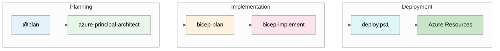

# Contoso Patient Portal Scenario Workflow

> **Version 1.0.0** | Last Updated: December 4, 2025
>
> **HIPAA-compliant patient portal using GitHub Copilot agents**

---

## 📁 Demo Files Index

| Step | File                                               | Agent/Tool                  | Purpose                        |
| ---- | -------------------------------------------------- | --------------------------- | ------------------------------ |
| 1    | [`00-plan.md`](./00-plan.md)                       | `@plan` (built-in)          | Initial deployment planning    |
| 2    | [`01-azure-architect.md`](./01-azure-architect.md) | `azure-principal-architect` | WAF assessment & HIPAA mapping |
| 3    | [`02-bicep-plan.md`](./02-bicep-plan.md)           | `bicep-plan`                | Implementation planning        |
| 4    | [`03-bicep-code-gen.md`](./03-bicep-code-gen.md)   | `bicep-implement`           | Bicep code generation          |

---

## 📊 Supporting Files

| File                                                     | Description                        |
| -------------------------------------------------------- | ---------------------------------- |
| [`contoso-cost-estimate.md`](./contoso-cost-estimate.md) | Detailed cost breakdown (~$207/mo) |
| [`architecture.py`](./architecture.py)                   | Python diagrams code               |
| [`contoso_architecture.png`](./contoso_architecture.png) | Generated architecture diagram     |

---

## 🚀 Workflow Summary

---

## 📈 Key Metrics

| Metric          | Value              |
| --------------- | ------------------ |
| Total Resources | 19 Azure resources |
| Bicep Modules   | 10 modules         |
| Monthly Cost    | ~$207 USD          |
| Region          | Sweden Central     |
| Compliance      | HIPAA              |
| WAF Score       | 8.2/10             |
| Budget          | $800/month         |
| Utilization     | 26%                |

---

## 🏥 Scenario Context

**Organization**: Contoso Healthcare
**Users**: 10,000 patients + 50 staff
**Compliance**: HIPAA (BAA required)
**Budget**: $800/month maximum

**Key Features**:

- Patient medical records access
- Appointment scheduling
- Secure messaging
- Audit logging for compliance

---

## 🔒 HIPAA Compliance Summary

| Control               | Implementation                   | Status |
| --------------------- | -------------------------------- | ------ |
| Access Controls       | Azure AD + RBAC                  | ✅     |
| Audit Controls        | Log Analytics (90-day retention) | ✅     |
| Integrity Controls    | TDE for SQL, checksums           | ✅     |
| Transmission Security | TLS 1.2+, private endpoints      | ✅     |
| Authentication        | Managed identity, Azure AD       | ✅     |
| Authorization         | Key Vault RBAC, SQL permissions  | ✅     |

---

## ⏱️ Time Investment

| Phase         | Traditional    | With Copilot  | Savings |
| ------------- | -------------- | ------------- | ------- |
| Architecture  | 4 hours        | 15 min        | 94%     |
| Bicep Modules | 6 hours        | 45 min        | 88%     |
| Cost Estimate | 30 min         | 5 min         | 83%     |
| Documentation | 2 hours        | 15 min        | 88%     |
| **Total**     | **12.5 hours** | **1.3 hours** | **90%** |

---

## 🎯 Related Demo

This scenario output supports **[S03: Agentic Workflow](../../S03-agentic-workflow/)**.

See the demo for:

- Step-by-step presentation guide
- Prompts for each agent
- Audience talking points
- Customization options

---

## 📚 Implementation Files

- [Bicep Templates](../../infra/bicep/contoso-patient-portal/)
- [Main Orchestrator](../../infra/bicep/contoso-patient-portal/main.bicep)
- [Deployment Script](../../infra/bicep/contoso-patient-portal/deploy.ps1)
